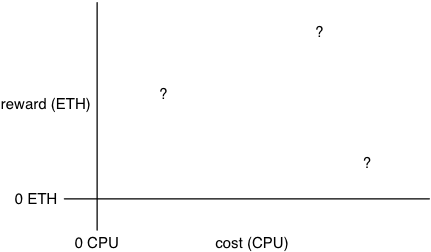
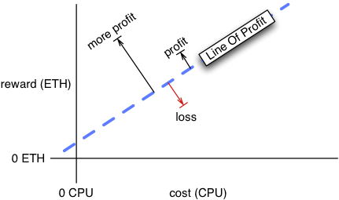
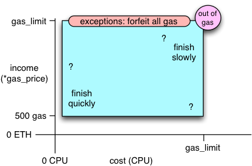
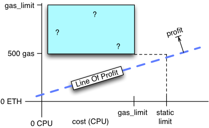
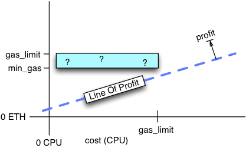
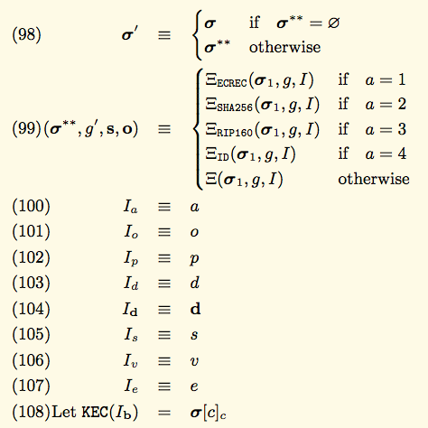
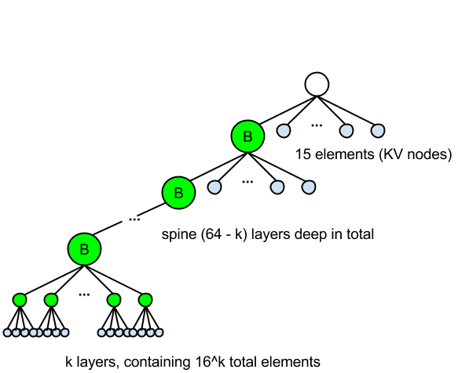

# Gas Economics

#### Table of Contents

* [Introduction and Executive Summary](#intro)
* Part 1: Goals and Incentives

  * [What the Network Wants](#network)
  * [What Miners Want](#miners)
  * [What Clients Want](#clients)
  * [Reconciling Goals](#reconciling)

* Part 2: Transaction Execution and Contract Composition

  * [Overview of Transaction Execution Model](#execution)
  * [Hazards of Composing Contracts](#hazards)
  * [Missing Features](#missing)

## <a name="intro"></a>   Introduction and Executive Summary

Ethereum supports computationally-rich contracts, written in a Turing-complete language. This enables a previously-unavailable variety of self-enforcing "smart contracts", where all parties involved can be confident that their funds will be used in a predictable fashion.

The downside of this increased flexibility is a new set of costs and threats for the miners and verifiers which execute these programs. Turing-complete programs cannot in general be statically analyzed to determine runtime or resource costs (storage, stack depth, etc). Programs which deliberately (or accidentally) get stuck in an infinite loop have the potential to stall the machine executing it. Programs which are merely complex or CPU-intensive still might "cost" more than the miner is willing to bear.

Ethereum compensates for this by introducing "gas", in which the initiator of a program's execution (the transaction sender) must pay for the resources thus consumed. This report explores the resulting "Gas Economics" model: does it provide the right incentives and protections to miners, verifiers, clients, and the system as a whole?

We also explore the ways in which Ethereum programs can be composed, with an eye towards managing the incentives and risks experienced by the cooperating/competing program authors.

_Executive Summary:_

* Ethereum's "gas" system *is* likely to meet its primary goals: enabling complex transactions while mitigating certain Denial-of-Service attacks.
* Changes will be needed in the future, when the system grows and gas fees replace block rewards as the primary income for miners.
* Contracts *can* be composed, but safe cooperation between mutually-distrusting parties will require careful study and rigorous defensive programming. Some changes to the virtual machine could be made to improve the safety of these compositions, and higher-level analysis tools must be developed. The programming examples included in serpent and found in the wild are flawed and inadequate for demonstrating best practices.
* The rule that "value remains with the recipient upon exception" is particularly surprising and difficult to work around. We highly recommend changing this to "value reverts to the sender upon exception".

## Part 1: Goals and Incentives

## <a name="network"></a>   What the Network Wants

_Summary: Incentivized mining, client confidence, a rich ecosystem._

The end goal of Ethereum is to provide a stable and expressive computational cryptocurrency: a system to perform decentralized verification of arbitrary programs, which can store and transfer currency units along with traditional data messages.

Decentralized verification depends upon majority consensus: "everybody" should agree upon the exact inputs, order, and results of program execution. All participants should be able to learn the full state and program code of all contracts at any time. This allows users to correctly predict whether others will accept their currency or not (i.e. how much they can spend). And, for the most part, they can confidently predict what will happen when they send messages to other contracts. The stability of the system, and people's willingness to use it, depends upon this confidence.

"Mining" is the distributed process by which this consensus is reached. This takes significant computational resources, for which miners expect to be compensated. The system needs consensus; consensus depends upon miners: thus the system needs a way to incentivize mining.

## <a name="miners"></a>   What Miners Want

_Summary: Predictable costs and income, profit optimization, DoS protection._

The Ethereum execution model is effectively a linear series of transactions. Each transaction contains a signed instruction to send a single message to a single account, which may cause a program to be run, resulting in changes to a large table (the "state vector"). This table records a currency balance and arbitrary stored data for each of a very large number of "accounts".

Clients publish transactions which they would like to be incorporated into this evolving history. Miners choose a subset of these transactions, in some particular order, then act upon the messages (executing programs in response) to generate "blocks" with the resulting state vector changes. They participate in some sort of Proof-Of-Work contest to earn the right to publish their particular block.

"Verification" is a process that starts with a block of transactions, executes the same messages (in the same order), and compares the results against the block's claimed state vector. All miners are also verifiers. Many more nodes will want to verify blocks but not perform the expensive proof-of-work function that miners use.

### Costs and Rewards

Verification consumes CPU time, short- and long-term storage, and other overhead costs. This is modeled (with varying accuracy, see below) as scalar units of "**gas**": basic addition costs 1 unit, a SHA3 hash costs 10, modifying storage costs 100, etc. More complex programs consume more gas. Long-term storage costs must be borne indefinitely. Each transaction in a block may trigger execution of a program; the cost to verify the block is the sum of the cost to execute each program, plus additional overhead for the block itself (which is not recouped by the gas fees).

On top of the costs of verification, miners may expend an arbitrarily large amount of resources in trying to solve a proof-of-work (PoW) puzzle. The PoW cost for each block is independent of the messages and programs included in that block. Verifiers do not incur this cost, only miners.

Miners receive a reward for their efforts, denominated in ETH, the basic currency unit of Ethereum. Part of the reward (`Block_Reward`) is independent of the messages included in the block. This portion is the means by which new currency units are introduced into the system ("expansion").

The other portion (`Program_Gas_Income`) comes from "gas": a fee paid by message senders to cover the computational costs of program execution they have triggered, summed over all messages included in the block. Over time, as transaction volume increases, the income from gas is expected to dominate.

All verifiers pay the costs of verification. All potential miners pay the costs of both verification and PoW. Only the winning miner gets the block and gas rewards. The generally-accepted social contract is that miners will win blocks in close proportion to their mining power.

The cost of verifying blocks is one constraint on the mining process. There are others:

* Blocks which are too large will take a longer time to store, transmit, and process. If two miners find and publish blocks at roughly the same time, then the large block may lose the race to a smaller block that finishes the verification process earlier, encouraging miners to produce smaller blocks.
* To protect the rest of the system (e.g., to prevent denial of service attacks on verifiers and light clients), blocks are limited both by size (in bytes) and their computational requirements (in gas). The per-block `gasLimit` is dynamically adjusted as a moving average: see [misc/RaisingGasLimit.md](misc/RaisingGasLimit.md) for more notes and attacks.
* Miners may have vested interests in particular contract state outcomes, for example if a contract makes payments to miners in certain conditions, or if a particular miner profits from a particular contract's behavior.

These constraints may encourage miners to be selective, to not include all potential messages in their blocks, or to alter the order of messages when creating a block. Miners can be expected to do whatever they can to maximize their profits, even producing blocks with no messages at all.

### Predictable Profits

For each block, the average income (in ETH) is thus:

    Mining_Power_Fraction * (Block_Reward + SUM(Program_Gas_Income))

Here we make the simplifying assumption that miners are not influence by contract outcomes.

And the CPU costs (in less well-defined units) are:

    Mining_Cost + SUM(Program_Execution_Cost)

A miner's profit is income minus cost. To maximize their profits by selectively including some messages but not others, miners want to accurately (and cheaply) predict both the income and cost from each transaction. Miners are nominally faced with a income-vs-cost diagram like this:



in which, as a first step, they want to determine the profit (or loss) resulting from including any given message in their block. They want to outright reject any non-profitable messages. When faced with constraints that limit the number of messages they can include in a block, they will want to select the most profitable ones. (The optimal subset is a form of knapsack problem and is not cheap to compute, `O(2^n)`, but good-enough solutions are fairly easy to obtain).

Ideally, for each message (program execution), the miner should be able to predict exactly how much reward they will receive, and how much their CPU and storage costs will be. They want to know a single point in the income/cost diagram, and where it stands in relation to the "line of profitability":



_Recommendation: research and develop algorithms and mining strategies that help miners to predict their per-message income_

### Loose Bounds of the Current Gas-Limit System

The existing mechanisms offers an upper bound on the computational costs, but no lower bound. These same mechanisms offer an *upper* bound on the gas income, but no complexity-dependent *lower* bound. The result is useful for discouraging denial-of-service attacks, but does not give miners the information that they want to maximize their profits.

Transactions (which trigger program execution) include two parameters: the "gas limit" (denominated in gas) and a "gas price" (ETH per gas). Miners execute programs in a virtual machine, counting operations as they go. The moment the VM exceeds the gas limit, execution is terminated, and all gas is forfeit (paid to the miner). This is the most gas-related income the miner can possibly make (any exception, including out-of-gas, forfeits all gas to the miner).

But if programs complete quickly, they may consume very little gas. All unused gas is returned to the sender. The minimum amount that can be consumed is defined by `G_transaction`, currently 500 gas, which is the baseline price of sending a message at all (before any opcodes have even been executed). An empty program will thus yield about `500*gas_price`, and an exception-raising program will yield `gas_limit*gas_price`.

An empty program will finish very quickly, using some constant overhead. A complex program will take more CPU time, but is still roughly limited by `gas_limit`. A tighter bound on CPU usage is not generally possible: some special cases may be amenable to static analysis, but Turing-complete programs cannot be analyzed completely by other Turing-complete programs. To do so would be equivalent to solving the Halting Problem. They must simply be executed, either to completion or until some threshold is exceeded.

So miners are given the following (loose) bounds, and must make their profitability decisions on this limited information:



One possibility is that `gas_price * G_transaction` is so high, and CPU time is so cheap, that all reasonable (e.g. statically limited) values of `gas_limit` result in profitable transactions. Miners can simply ignore messages with `gas_limit` above some static value.



This, however, does not give miners information about how *much* profit they might make, so they cannot meaningly prioritize transactions. `gas_price` is likely to serve as a proxy for the early days of mining: txns which offer a higher `gas_price` are more likely to yield a larger profit.

_Recommendation: improve miner's abilities to predict their per-message income and CPU consumption, so they can prioritize profitable transactions. Reduce the size of the potential cost-vs-income rectangle in the diagram above._

### Inter-Message Constraints: Reordering Transactions for Fun(?) and Profit

Transactions are not actually independent: it may be necessary to include some less-profitable or even unprofitable transactions to increase the profitability of a subsequent transaction.

For example, since transactions include a per-sender sequence number, and these must be applied in strictly incrementing order, the miner could be faced with one high-cost low-income transaction `(from=ABC seqnum=5)`, followed by a low-cost high-income transaction `(from=ABC seqnum=6)`. The miner cannot legally include the second message without also including the first. They must evaluate the profitability of the two as an indivisible pair.

Adjusting the order of different-sender messages may improve profits. Since exceptions forfeit all gas to the miner, if there is an ordering of messages that forces an exception, the miner would prefer exception-causing sequences over ones that complete normally. Likewise, a sequence that causes execution to consume more gas will yield more income than one which completes quickly (and more profit, assuming the actual CPU costs are low). So, more sophisticated miners may do more work: computing an optimal *ordered subset*, not merely an optimal subset.

The costs of doing this analysis must not exceed the gains to be had. Finding an optimal ordered subset is even more expensive (`O(n!)`) than an unordered subset, but clever miners may find ways to make it worthwhile. These miners would like enough information to efficiently choose a profit-optimal ordered subset of the available messages.

_Recommendation: when designing contracts, guard against miners who may reorder or drop messages to provoke exceptions and other undesirable outcomes (which are profitable to the miner)_

### Gas Inaccuracies/Inadequacies

"Gas" is a fairly coarse measure of miner/verifier costs. It attempts to compress the numerous forms of computation cost (CPU clock cycles, short-term memory usage, long-term storage usage, etc) into a single scalar value.

There will inevitably be a number of under- and over-priced opcodes, for which their arbitrarily-assigned "gas" value is not representative of their true costs. For example, `G_sha3`, the cost of a basic SHA3 operation (before including input size), is currently set to be 10 times the cost of a basic one-cycle addition operation, despite being a vastly more complex operation that takes thousands of CPU cycles. SHA3 may be an underpriced opcode. Also, the actual processing cost of opcodes is unlikely to be identical for every miner or verifier. For example, some verifier's machines may contain a SHA-2 coprocessor.

Contracts which use lots of underpriced opcodes may consume more actual CPU time than the miner had first predicted: a low `gas_limit` doesn't necessarily mean low CPU usage. Likewise, overpriced opcodes may yield more overall profit.

Storage costs are particularly difficult to measure with the same units one uses for computation. Contract storage operations (`G_sset`) obligates the miner, and all verifiers, to store a word of data *forever*. There is a kind of refund mechanism that provides a weak incentive to free storage (`R_sclear`), but it is local to a single message, and is unlikely to effective in prompting contract authors to conserve storage space.

An ideal storage economic system would have contracts pre-pay for storage in units of `byte*seconds`, with a facility to periodically renew leases on that storage. However, this would add complexity.

_Recommendation: pay close attention to opcodes and VM features that may cost significantly more than their assigned gas value suggests, long-term storage in particular._

### DoS Prevention

The main motivation for denominating computational costs in gas is to prevent Denial-Of-Service attacks, in which clients send transactions with infinite loops, excessive recursion, or unwieldy memory consumption. Miners and verifiers must all execute these programs.

Paying for "gas" obligates the client to pay for these resources. You can send someone an infinite loop, but only if you send them infinite gas as well. Sub-infinite consumption requires signifcant payment.

Establishing a universally-understood metric for "too much computation" is important, because when a client forfeits their gas (by overrunning their computational limit), the miner gets to claim that gas for themselves. To ensure that the miner isn't merely pretending that the program was too hard to run, all other miners and verifiers must run it for themselves, and confirm that it does indeed not complete before the gas limit is reached. Everyone must agree on how hard is "too hard", and the gas-counting VM provides that consistency.

However, some amount of overhead is incurred by each message before they have had a chance to yield any gas income. Messages must be received from the network, stored, their signatures must be checked, `gas_limit` and `gas_price` must be evaluated, and the sending account balance must be checked for underflow. Any messages which are rejected before reaching this point are pure cost and zero income. DoS attacks which target these checks will not be prevented by the gas system.

_Evaluation: the gas-based VM should be effective in preventing transactional-complexity -based DoS attacks, but not more traditional attacks that do not result in VM evaluation._

### Verifiers Must Just Follow Along

Non-mining Verifier nodes (which are expected to outnumber the miners considerably) are responsible for executing all programs on the longest blockchain, but get none of the income. Their only reward is being able to use the currency with confidence. Miners, when they verify blocks produced by other miners, have a similar situation: they must pay the cost of running those programs, but get no gas income: their reward is the ability to continue mining on the longest chain.

These verifiers do, however, have the benefit of being told total gas value used by each block. This allows them to terminate the computation after a bounded number of gas operations. They do not really have a choice of whether to perform these operations or not, but they can probably determine how long it will take, and will not need to put up with infinite loops.

Extremely lazy miners could simply ignore all new transactions, assume the longest chain contains only valid transactions, and perform no validation of their own. This would not improve their proof-of-work hashing power significantly, and would be vulnerable to invalid blocks, but it would be drastically simpler than a real miner.

_Recommendation: consider lazy non-verifying "miners" and make sure they do not have a signifcant performance advantage over real ones. Messages with sufficient gas income will help._


### Constraints, and the Lack Thereof

Until block-size or block-gas limits are hit, gas is mostly a tool to prevent DoS. Prioritization becomes interesting once verification time is significant (compared to mining or other tasks that compete for CPU), or block constraints prevent inclusion of all transactions.

_Observation: we may not really understand the potential attacks or misincentives until the system grows enough to impose significant constraints on miners._

## <a name="clients"></a>   What Clients Want

_Summary: Predictable results, reliable execution, minimized cost risk._

Clients, who send transaction messages but do not run a miner, simply want to use the digital currency. Their foremost concern is how much ETH they have, and what will happen when they spend it. Basic transfers are straightforward, so Ethereum's novelty is in triggering complex programmatic actions in response to messages that bear currency.

### Predictability

Clients want predictability: when sending ETH to a contract that claims to implement a Kickstarter-like escrow service, or a Namecoin-like allocation service, clients want to know that the contract will actually behave the way it was supposed to. This behavior includes contract state changes (e.g. the requested name is actually reserved), what other contracts are executed as subroutines, and how much gas is consumed in the process.

Failed predictions can result in unnecessary gas reservations, delayed transactions, missed opportunities, or even financial losses.

Contract behavior, and thus transaction results, depends upon three things:

* the contract's code
* the message's contents and attached value
* the state of the data store when the contract is executed

The code is fixed, public, and can generally be analyzed ahead of time. The message contents and value are entirely controlled by the sending client. But the data store depends upon what other contracts have been executed recently.

This implies a race condition: between the time the client examines the stored state of the contract they want to invoke, and the time their transaction is accepted by a miner, other messages could be applied that change the state.  This classic TOCTTOU (Time Of Check To Time Of Use) race is a constant source of bugs in threaded programs.

The most significant failure mode is an exception, such as out-of-gas. In this case, all gas ("gas_limit") is given to the miner, all other funds included with the message (the message's "value") are delivered to the target contract, and all other state changes are reverted. The receiving contract has no idea that message delivery was attempted, except for the mysterious extra money in its balance, and does not know who to refund the money to even if they wanted to. This could leave funds in limbo, unretrievable by the sender, and invisible to the recipient.

_Recommendation: Contract users should avoid exceptions at all costs. They must study contracts carefully before sending money to them, treating the contract and the miner as colluding antagonists who seek to cause an exception by any means possible. Develop static-analysis tools to prove that contract execution cannot result in an exception._

_Strong Recommendation: Change the exception-handling rule to revert all funds (except gas) to the sender._

### Test-And-Set

A common mitigation for concurrency hazards like these is to use atomic "Test-And-Set" operations. In the Ethereum context, messages could include a block number, and the execution rules would state that the message could only be included in that specific block. Or they could include the hash of the most recent state vector, and could only be applied on top of that specific state.

This would result in a fixed total-ordering of the transaction list. Clients would be able to exactly predict the results of their changes. They would also be able to predict exactly how much gas was used by the computation, and set `gas_limit` to precisely that quantity. The rule that unused gas gets returned to the sender could be removed, because there would never be unused gas. Miners would then know that they would receive exactly `gas_limit` units of income.

### Flexibility

However, an exactly-predicted system would be completely unusable for more than a few clients. Large distributed systems do not deliver the state of the world to all clients at the same time: everyone is slightly behind. Almost all clients would find their test-and-set messages were constantly being rejected for an out-of-date test vector. By demanding that the *entire* state is matched, the system would be sensitive to the slightest of races, and most of these transactions would never be applied.

In terms of the well-known CAP Theorem" of distributed databases, the "match complete state" rule is roughly analogous to choosing 100% "C" (consistency) and abandoning "A" (availability).

Clients are thus also interested in flexibility: the ability to get reasonable work done without maintaining an up-to-the-moment copy of the entire Ethereum state vector. This is the "A" in the CAP theorem.

The CAP theorem tells us that you cannot get perfect consistency and availability at the same time (a distributed system must always provide "P" partition tolerance). While Ethereum is not an exact match to the environment of the theorem, this result still implies that we must decide upon a sensible tradeoff between predictability and the ability to deliver transactions that are highly likely to be applied.

A more-likely-to-succeed rule might be that the transaction would describe (and thus test) the state of just the contract to which it is being sent. This could be implemented by including the recipient "nonce" (sequence number) in the message, and rejecting messages which arrive at a miner to find the wrong seqnum. Unrelated messages could be executed in arbitrary order, and the strong ordering requirements would only affect transactions that involve the same target.

However, the target contract may call other contracts as subroutines, expanding the amount of relevant state that could affect the results. Worse yet, the set of subcontracts may not be static: the program may compute the address of the subcontract depending upon the message contents, or upon the return value from earlier subcontract execution. Getting this right for arbitrary programs is just as impossible as the Halting Problem.

Finally, some inputs are not known to the sending client at all. The `COINBASE` opcode returns an address, provided by the miner, to which the gas and block reward will be delivered, for the block in which this message is being placed. This will be different for each miner, so the resulting execution trace will depend upon which miner wins the PoW race. It could be different for each block. Any contract which uses this opcode will be harder to predict.

_Recommendation: consider low-cost ways to give senders more control over the environment in which their messages are executed, including a receiver sequence number (in addition to the current sender seqnum)_

### Limiting Gas Risk

For simple programs, with minimal conditional branches and use of subcontracts, the client may be able to exactly predict how much gas is consumed. In this case, they can supply a precise `gas_limit` and be confident that the transaction will complete, with no gas returned.

However, if there is uncertainty, the client must supply a little bit extra. This is a gamble, and there are risks on both sides. If the client provides too little gas, they run the risk of an expensive out-of-gas exception (in which they lose the gas, the entire transferred value, and accomplish no contract actions).

If they provide too much, the chances of out-of-gas are reduced. Thanks to the "unused gas is returned to the sender" rule, the extra gas is not lost. But there is still an opportunity cost: the client must have that extra ETH available, they must wait until the transaction is retired until they know how much ETH they have left, and they cannot use that ETH for something better in the meantime. Needing to keep extra money around, just in case, is a cost all by itself, not unlike the costs of securing a loan or a line of credit.

And if something goes wrong and the computation gets stuck in an infinite loop, the "little bit extra" will be lost. Imagine the simplicity of a rule where you didn't need to predict the gas usage of a program, because the gas was simply taken from the sender's account. Then imagine the panic of writing code in this environment, where a trivial programming error could drain your entire wallet. So providing too much gas is a risk too.

Clients want to maximize the chances that their transactions will be applied, in a predictable way, without spending or risking too much currency in the process.

### Fast Transaction Resolution

Clients pay miners to include their transacations. Left to their own devices, miners would prefer to ignore transactions: they're annoying to verify, require significant bandwidth (both in and out), and long-term storage. A miner with cheap electricity (e.g. Proof-of-Work costs are low), but expensive bandwidth, may be very reluctant to fetch anything other than block headers. These "lame" miners would simply publish empty blocks all day long.

Even well-connected miners might prefer to reduce their operating costs by ignoring transactions. Clients must provide enough transaction income to overcome this reluctance.

If a significant fraction of miners are accepting high-fee transactions but ignoring low-fee ones, clients will achieve faster resolution by increasing their fees. This effect is rapid: the outstanding txn with the highest fee should appear in the very next block. This creates a market for resolution speed that should self-regulate nicely.

If enough fee income is visible, the "lame" miners may decide it is worthwhile to participate properly. This effect is slower, since full participation requires more time to set up (changing software, acquiring storage and bandwidth, etc). It is unclear whether this will produce a functioning market equilibrium.

### Bribing Specific Miners

These client-to-miner payments are normally delivered as "gas". Clients could also add a statically-detectable `SEND(COINBASE)` prologue, to send a quantity that is more predictable (by the miner) than gas. Both mechanisms deliver the same reward to any miner.

Clients might, for some reason, want to give preferential treatment to some miners over the others. They could do this in several ways:

* include a `send()` to COINBASE if and only it equals a predetermined value
* clients could reveal a function output to their favorite miners, allowing the miner to bypass the computation while pocketing all the gas (e.g. reveal a hash preimage, for a program which does an exhaustive search). Everyone else would have to burn more CPU to run the full program, but the favorite miner gets a shortcut.

We expect that this is unavoidable: clients will always have a way to induce non-uniform costs among competing miners. We are uncertain, but doubtful, that this could be used for mischief.


## <a name="reconciling"></a>   Reconciling Goals

So the goals for our different parties are:

* System: stability, incentivized miners, confident clients
* Miners: predictable profits, protection from resource consumption attacks
* Clients: predictable transaction results and gas usage, availability

A totally-ordered exact-state test-and-set model would yield complete predictability. Miners would achieve their goals: both CPU usage and gas income would be known in advance, so they could select the most profitable transactions to include. Clients would get predictable results and gas usage. However, availability would be fatally lost. Even allowing miners to select which transactions were applied would cause most subsequent messages to be rejected.

Whatever flexibility we allow clients, to reduce their state-observation burden and improve transaction availability, will come at a cost of reduced predictability for both miners and clients. The unpredictability of client gas usage prompts us to include the "refund the unused gas" rule, to establish an upper limit on client costs. But this means that miners income becomes unpredictable, `gas_limit` is a frustratingly-useless maximum bound, and the only thing providing the desired *minimum* bound is `G_transaction`.

In the beginning, this won't matter much. As with Bitcoin, most miner income will come from the block reward, not transaction fees. But over time, if the currency gains value, the fixed-ETH block reward will become less signifcant. As contracts become more complex, and their gas costs are no longer dominated by the 500-gas `G_transaction` baseline, the task of properly incentivizing miners will depend upon providing them with good information about their costs and income.

So in the future, Ethereum may benefit from mechanisms that allow a client to make a clear promise of income to the miners. This may take the form of a `min_gas` message parameter, which would make no promises about the execution runtime, but *would* guarantee a minimum income for the miner. If the potential CPU cost are low enough, this might provide enough information to allow miners to prioritize transactions appropriately.



`min_gas` could be hacked into the existing model with a recognizable function epilogue that deliberately wastes gas until almost none is left. Something like:

```python
while GAS() > 5:
    NOP
RETURN
```

Miners could do just enough static analysis of a program to convince themselves that 1) this epilogue exists, and 2) there are no return pathways that might bypass it. If both are true, then they can expect to receive almost the entire `gas_limit`, and one axis of their uncertain profit/loss model is reduced to a small range. Since callers don't want to waste gas, they will probably try very hard to accurately predict their usage, and this loop can be expected to run very few times, so the runtime is probably bounded pretty well too. Miners who recognize the epilogue could skip its execution, pocketing the gas money without spending the cycles on the known-worthless computation.

Alternatively, since the goal is to pay the miners, the transaction could simply transfer a balance to the COINBASE address at the very beginning of the transaction. Barring exceptions, this would be easy to detect statically, and provides a known income to the miner. If the actual gas used is small compared to the known reward, the miner can better predict their profitability.

The use of such "in-band" hacks is inelegant, however, as it requires a certain usage agreement between contract authors and miner implementations, which could be signalled much more cleanly through an "out-of-band" parameter that requires no program analysis.

_Recommendation: consider adding a `min_gas` to the message metadata, to provide a predictable minimum income_


## Part 2: Transaction Execution and Contract Composition

## <a name="execution"></a>   Overview of Transaction Execution Model

The "Yellowpaper" (LaTeX source in https://github.com/ethereum/yellowpaper , and compiled PDF at http://gavwood.com/Paper.pdf) is the primary specification for Ethereum, the canonical reference that resolves any disagreements about how a correctly-conforming implementation should behave.

Git revision `ed0b9c4d5c34da08b355e537012ef0faae024df4`, from the github repository URL above, was the basis for most of this analysis. However some portions may rely upon an earlier version, as the paper was modified during the review period.

_Recommendation: find a way to include the git revision hash in the published PDF._

Ethereum is pleasantly unusual for having its core behavior defined by human-oriented prose. Many other systems (e.g. Bitcoin, perl, python) simply declare that a specific implementation (usually the first, written by the original system architect) should define the canonical behavior. This results in "bug-for-bug compatible" reimplementations and ports, underspecified behavior, and unnecessarily-machine-specific details being written into the spec (e.g. alignment and byte-ordering).

Cryptocurrencies inherently depend on mutually-agreed-upon behaviors among diverse parties. A strong, precise, and readable specification enables multiple implementations to interoperate. Subtle differences in behaviors can result in painful blockchain forks years down the road, and security vulnerabilities as one party interprets unusual transactions differently than another.

The yellowpaper does an admirable job of capturing everything one needs to know to write a compatible implementation. Ethereum is very complex, so this is no easy feat.

However the paper is dense, intricate, and difficult to follow. Our team required intense study to determine the expected behavior. It uses a wide variety of notation, which hampers legibility: multiple typefaces, English and Greek characters, subscripts, square-bracket indexing, superscript-prime, superscript-star, superscript-double-star, etc. We feel a some simple alterations to the document could dramatically increase readability, such as avoiding overlapping/shadowing variable names, reducing or better explaining recursive definitions, and mitigating the forward- and backward- references.

<!--- We are concerned that the difficulty of comprehending the yellowpaper will lead to inconsistent implementation behaviors, especially in new clients that have not yet been written, whose developers may not consult the core community which wrote the (most "official") Go and C++ codebases.
 Concern noted, however Java and Javascript implementations were written from the ground-up using just the Yellow Paper, and acheived substantial success.--->

Implementation consensus bugs will probably be caught with good testing practices and a large number of independent implementations, however we would feel better if the primary specification were easier to follow. Ethereum is not simple and cannot be described simply, and while it is possible to build a fully-compatible implementation by reading only the formal specification, we feel that current and future implementors would be well-served by contributing and improving its readability.
# Reworded to concur with the previous statement that it contains everything needed for a compatible impl.

_Recommendations to improve the specification:_

* Use pseudocode instead of equations
* Use property-access instead of subscripts (`txn.value` instead of `T sub(v)`)
* Use multi-character variable names instead of overloaded Greek letters
* Avoid reusing symbol names in different contexts (formal- vs actual- parameters). A given symbol should have the same meaning in all occurrences. Related values (such as the gas provided with a message, distinguished from the gas provided to execute a specific sub-function) should have related names, like `message_gas` vs `execution_gas`.
* Function names should be unique, and their definitions should be clearly marked. Argument lists should be consistent. E.g. section 8 "Message Call" invokes upon the Xi function (in equation 99, rev cdc8499), and appears to receive four return values. The Xi function is defined (with six return values) in equation 109, and again (in terms of an "X" function, with four return values) in equation 110. These could be rewritten as pseudocode-style function prototypes (`(ret1,ret2) = function X(arg1,arg2)`), and the forward reference could be marked with the equation number (or page/section) of the eventual definition.

As an example, section 8 "Message Call", (equations 98-99 in revision cdc8499 on 20-Apr-2015) currently reads:



and could be rewritten to look somewhat like:

```python
def get_code(address):
    if a == 1: return ECREC
    if a == 2: return SHA256
    if a == 3: return RIP160
    if a == 4: return ID
    return accounts[address].code_bytes

# returns (newstate, remaining_gas)
def run_message(state, sender, originator, recipient, code_account,
                avail_gas, value, gas_price, input_data, current_stackdepth):
    exception_rollback_state = state.copy() # no funds moved yet
    state.accounts[sender].value -= value
    state.accounts[recipient].value += value
    try:
        (newstate, remaining_gas,
         suicide_list, output) = execute(state, avail_gas,
                                         owner_address=sender,
                                         originator_address=originator,
                                         gas_price=gas_price,
                                         input_data=input_data,
                                         sender_address=sender, value=value,
                                         code_bytes=get_code(code_account),
                                         current_block_header=xyz,
                                         stack_depth=current_stackdepth)
        return (newstate, remaining_gas)
    except CodeException:
        state = exception_rollback_state
        state.accounts[sender].value -= avail_gas * gas_price
        return (state, avail_gas)

# returns (newstate, remaining_gas, suicide_list, log_series, refunds,
#          output_data)
def execute(oldstate, gas, owner_address, originator_address, gas_price,
            input_data, sender_address, value, code_bytes,
            current_block_header, stack_depth):
    ...
```

* Consider using diagrams to show function inputs and outputs
* Find a better format for the opcode definition table (appendix H.2), perhaps `GAS: () -> (exec.remaining_gas)` or `ADD: (a, b) -> (a+b)` instead of referring to `mu prime sub s [0]`
* Define the gas costs in the opcode table

_Recommendation: consider commissioning a dedicated technical writer to produce a longer-form specification document, and declare it to be the canonical protocol authority._


### Transaction Execution Basics

* **Transactions**: Every update to the blockchain state is initiated by a transaction. A transaction must be initiated by a user account with a public key (and not by a contract acting on its own), and is signed by the corresponding private key. A transaction must indicate a gas price `P` (in units of _ether per gas_) and a gas limit `G` (in units of _gas_); at the beginning of transaction execution, `P*G` ether units are deducted from the user's account, and `G` gas units in total are available for executing the transaction.
* **Message calls**: A transaction indicates an initial recipient. If the recipient is another user account, then no virtual machine execution is needed, the account balances are simply updated. However, if the recipient is a contract, then code must be executed. When a contract sends a message to another contract, a new execution context is pushed onto the call stack. The caller sets aside a portion of its available gas to be used by the callee - even if the callee crashes, it can use at most this portion; if it uses less than that limit, the difference (in gas) is refunded to the caller.
* **Closing list**: When a contract executes a _close_ (aka `SUICIDE`), its address is added to a list. Closed contracts are deleted at the end of transaction execution.
* **Refund counter**: In the case that storage cells are freed (i.e. a zero is written to a location that previously had a non-zero value), this counter is incremented. When execution is finished, some portion of this counter is refunded to the sender. This incentivizes conservation (deallocation) of storage space. These "refunds" will not allow a computation to exceed the `gas_limit`, nor can they reduce the ETH spent on gas to drop below (or even to) zero.
* **Exceptions**: While a contract executes a message, there are 4 "Exceptional Halting" states: insufficient-gas, bad-opcode, stack-underflow, and bad-jumpdest. If one of these occurs, message execution is terminated, all gas is given to the miner, and **all remaining message value is left with the recipient**. When the message is processed as part of a subroutine, the caller can tell that the child contract executed with an exception, but they cannot retrieve the funds sent into the child. When the message is being processed due to a top-level transaction, the sender must follow the published block chain to discover the fate of their message.

_Observation: the yellowpaper seems inconsistent on the issue of call-stack-overflow. Equation (113) does not mention the call-stack size, but the prose afterwards claims that call-stack-overflow is an exceptional halting state (Z=true). The Appendix H.2 definition of CALL on page 28 suggests that call-stack-overflow merely pushes an error indication onto the data stack. We believe the latter: call-stack-overflow is not an exception._

_Recommendation: in serpent, change `tx.gas` to `msg.gas`, as it is a property of the message execution rather than the transaction._

_Recommendation: replace the instruction name "suicide" with a less connotative word like "self-destruct", "destroy", "terminate", or ["close"](https://www.translegal.com/lesson/7035), especially since that is a term describing the natural conclusion of a contract._ We'll use "close" throughout our report.

The refund counter will only incentivize the deallocation of space if this occurs during a complex transaction (which can benefit from the gas refund). Callers will never send a single message just to deallocate space, since they must pay `G_transaction` just to send the message, and "refunds" will not actually give the sender any money.

_Evaluation: the "refund counter" mechanism is insufficient to encourage deallocation of storage space. This storage pool, which must be tracked by all verifiers, forever, represents Ethereum's largest long-term execution cost, and it is important to keep it as small as possible. Although complex, a pre-paid renewable "rental" model, denomimated in byte*seconds, is more likely to protect against unnecessary growth of the storage pool, and accidental "leaks" of storage space to abandoned contracts. A similar mechanism may be warranted to expire contracts themselves. Ideally the state vector should only include active contracts, not forgotten leftovers._

### Signature Ambiguity

The account public key can be used to verify transactions and identify the sender. It may also be used, outside of the Ethereum codebase, to verify other statements signed by the holder of the account's private key. For example, when someone starts a crowdfunded project, they will need to create two accounts. The first is a normal public-key account, to which the ETH will be delivered if and when the funding goal is reached. The second is the contract account which implements the threshold/refund mechanism and embeds the address of the first account where everyone can see.

Then, the project lead will publish a message, outside the blockchain, signed by the first account's public key, identifying themselves and describing the project goals. This assures donors that they are funding the *right* project, or at least a project that claims to do what they want to fund. Later, if the project is funded, that person will use the same key to sign a transaction message, to spend the funds.

It is important that these signed non-transactions can be distinguished from signed transactions. Otherwise, the system will be vulnerable to confusion attacks, where the signed project description gets fed to a miner and misinterpreted as a signed transaction. It might seem unlikely that English text could produce useful results when interpreted as a transaction, but similar format-confusion bugs have yielded serious attacks against other systems. SQL-injection attacks are in this category, as are web attacks in which executable content (Flash programs) are hidden as plain image files.

There are two standard defenses against this attack. The first is to never sign a raw message: instead, always prepend a "purpose" string to the message before signing. Different purposes (project description vs transaction) get different purpose strings; frequently a domain name or URL is used to avoid accidental collisions without explicit coordination.

The purpose prefix must be prepended unambiguously: it must not be possible for `prefix1+msg1` to equal `prefix2+msg2`, otherwise the prefix itself is a format-confusion bug. Fixed-length purposes can be simply concatenated, but are annoying to use. Purpose strings that specifically omit a given character can be join with that character as a delimiter (e.g. the purpose is a URL, and the delimiter is a newline). A length prefix can be used for finite-length purpose strings with arbitrary contents (0x00-0xff). If the purpose string is truly arbitrary-length, then the only viable technique is to escape the delimiter wherever it appears.

This approach requires the purpose-string prefix be used from the very beginning: it cannot be added later. Each purpose lives in a non-overlapping branch of a parse tree (where the root is a completely random message). Once a portion is claimed, it cannot be used for other purposes.

The second defense technique is to use a keyed hash function, and use a different key for each purpose. Instead of signing the transaction message `T` with a plain unkeyed hash function (`hash(msg=T)`), use a keyed hash function, and sign `hash(key=purpose, msg=T)`. This approach imposes no restrictions on the purpose string, nor on the format of the message. It too must be deployed from the very beginning, for the same reasons.

_Recommendation: change the signing function (`h(T)` in appendix F of the whitepaper) to use a keyed hash, such as HMAC-SHA256._

### Unexpected Storage Costs

Storage operations may incur much greater actual costs than their assigned gas value suggests. Certain pathological sequences can put the storage trie in a non-optimal configuration, resulting in worst-cast traversal costs.


#### Creating Worst-Case Storage Layout

By choosing keys with deliberate patterns, a contract can cause the storage trie to become significantly unbalanced. Afterwards, storage operations will cost significantly more CPU than their gas price would suggest. This could be used as a DoS attack against miners.



_Recommendation: consider using `hash(key)` rather than `key` in storage trie to prevent users from "stacking" the storage in a poor configuration. The (significant) downside is that the trie would become completely sparse, losing the trie's space-saving key-compression properties._

_Recommendation: alternately, determine the gas cost of storage operations assuming a worst-case layout._

We made a tool to visualize Tries in graphviz, which is useful for illustrating and understanding the structure of the tries given varying inputs. [trie_debug.py](examples/trie_debug.py)

#### Reverting Storage Deletions

Similarly, making changes (even deletions) to an unbalanced trie is expensive, although the gas cost for it is zero (and even refunds some gas for the current message).

```python
def waste_steps(n_):
  with n = n_:
    with i = 0:
      while i < n:
	    self.storage[i] = 0  # These steps are cheap
		i += 1
	invalid()               # Revert the state by throwing exception
```

_Recommendation: change the cost of storage deletions cost so that **reverted** deletions are not underpriced. This can be done by charging deletions the same as modifications, and adding the corresponding ether amount (`gas * gasprice`) to the refund register._

#### Abusing the Storage Refund Mechanism

The storage refund mechanism (defined in equation (61) in the yellowpaper as of Feb 28) provides an incentive to clear out no-longer-needed storage. The intent is that this refund has already been paid for in advance, because of the extra gas used to initialize the storage in the first place. However, the gas price at the time of clearing the storage need not be the same as the gas price at the beginning. An attacker could plausibly exploit this by initializing a large amount of storage at a very low gas price, and later using it to claim refunds at a higher gas price. The exact implementation of the refund mechanism limits the profitability of this - the refund can not be used to print more ether than was put in at the beginning of the transaction, and can only reduce the effective gas cost of a transaction by up to 50%. However, even this 50% discount could conceivably cause the storage incentive to backfire. An attacker might 'squat' on a large amount of storage by initializing it to nonzero, either during a time when the market price of gas is low, or with collusion from a miner. If the market gas price later goes up, this stockpile of squatted storage can be valuable. Exacerbating this, the verification cost of this squatting might be made low if a convention is recognized. Consider this fragment of code:
```python
  # precondition: self.storage is all 0
  i = 0
  while i < 100:
     self.storage[i] = 1
	 i += 1
```
The gas cost, and the change to the state vector after executing this fragment, assuming the precondition holds, is always the same for every contract, and thus could be executed in constant time by any verifier.

#### Miner-vs-Miner Storage Bombs

As suggested above, a miner could produce a block with a single (large) transaction, which did nothing but fill a large amount of storage. They could set `gas_price` to 1 Wei (its lowest possible value), and provide just enough ETH to fund the transaction (which they immediately recover in full). By pre-computing the root hash of the contract storage, they can do this once per block with minimal overhead.

Other miners, and non-mining verifiers, are obligated to store this full dataset, while the original miner can simply recognize the Merkle root and synthesize the contents when necessary. Nobody else can change the dataset, since the attacking miner defined the contract which could do so.

A more sophisticated approach would involve a dataset whose values are pseudo-randomly generated from a secret key. The attacking miner could use the secret key to regenerate the storage as necessary, while other miners would have to store the entire (non-compressible) data.

This is a miner-vs-miner attack: imposing costs on other miners to slow them down.

The attack is constrained by `G_sset` (the cost of storage operations) and the moving-average per-block `max_gas` limit (which will rise in response to this attack, making it more damaging over time). A brief calculation suggests that this attack could add 768MB per day to the storage load.

(using max-gas of 1e6 from the current v0.8.5 go-ethereum codebase core/genesis.go, a `G_sset` of 300 gas, and a target block time of 12 seconds: 1e6/300 = 3333 words of storage added per block, 32 bytes per word, 7200 blocks per day, `3333*32*7200 = 768MB`)

The core problem is this: gas economics assume that rewards are shared uniformly among miners (in proportion to their PoW power), and costs are the same for all miners. However miners can insert their own transactions which don't reward anybody (the gas returns to themselves, and no other miners get to see the loose transaction, so they have no chance of earning the gas), and cost more for the other miners to verify.

We are uncertain how to fix this properly. The solution will probably include the winning miner being obligated to give some of their gas to other (subsequent) miners, to remove the "I pay myself so it's free" property.

#### Reducing Miner/Verifier Storage Costs

One (incomplete) mitigation is for miners to stop storing the complete state, and instead they merely store the hash of each account. Clients would be required to send them the missing state data with each transaction. When miners publish blocks to verifiers and other miners, they include the additional data next to the blockchain. This shifts the burden of storage from the receiving miner/verifier to the sending client/miner, at the cost of complexity in the protocol.

Willing clients can already do this "in-band": the contract can keep just the hash of their state in contract storage. Each client would be obligated to include the current state in their message, and the contract would check its hash before doing anything else. The contract would then run its normal computation, determine the new state, hash it, store the hash, then throw away the state (which clients would compute for themselves externally). The savings depend upon the relative values of `G_sreset`, `G_txdatanonzero`, `G_sload`, and `G_sha3`.

Further reductions could be obtained by only storing the root of the entire account tree, and require senders to include the Merkle-tree "uncle" nodes necessary to verify the claimed dataset's presence in that tree. Since transaction evaluation causes one or more account states to be modified (every account which receives a message is touched), the miner also needs to know the uncle nodes for all modified accounts, so it can recompute the new dataset hash root. This has been [discussed](https://bitcointalk.org/index.php?topic=314467.msg3371194#msg3371194) in the Bitcoin world.

The storage could be further outsourced: lightweight clients could pay an archival service for the necessary storage, and retrieve it just before delivering the transaction to the miner. Or clients could send just their transaction to the archival service, and ask them to look up and attach the necessary data, before forwarding it directly to the miner.

#### Reducing Storage Itself

Shifting the responsibility for storage to clients who care about it is useful, but the necessary protocol changes may be complex. A complimentary approach is to remove the storage altogether. Currently, storage can only be deleted if a contract chooses to delete it. Otherwise it lives until the contract self-destructs, which is also entirely controlled by the contract. 

This can easily result in contracts and data which are useless, broken, or abandoned, never to be used again, but consuming space in the Merkle tree and increasing computational load for everybody, forever. The gas-for-storage mechanism discourages the creation of this obligation, but does not adequately incentivize its release.

A more direct approach is to make storage (and contracts) decay. Contracts would be obligated to pay "rent" for storage, in the form of a counter that can be increased with ETH sends and decrements with every block. Contracts themselves would be kept alive with ETH.

This is related to a high-level economic concern about lost private keys, and the effect of this "money leak" on the inflation rate. One suggestion in the Bitcoin world has been to have BTC revert to the miners if it is not moved on a regular basis. A more sophisticated scheme could allow accounts (and contracts) to pre-specify a "beneficiary" to which its value would go if/when it expires, just like a will that disposes of a person's estate when they die.


### Exceptions

Our current understanding of the VM execution model (complicated by divergent behavior of the pyethereum implementation, errors in the specification, and changes to the yellowpaper during review) is that there are exactly four things that can cause a program to terminate with an exception:

* insufficient gas
* bad opcode
* stack underflow
* bad jump destination

When one of these exceptions occur, execution of the current message (top-level transaction or CALL operation) is abandoned, all gas is given to the miner, and any remaining money is left with the *receiving contract*. All other state is rewound to the start of the CALL or message delivery. The recipient has no memory of the message, except for the mysterious extra ETH in its account, with no record of the sender to refund it to. For CALL operations, the caller learns of the exception, but has no way to recover the funds that were sent. This may lead to money being lost, and will be difficult for both sender and receiver to deal with.

For this reason, the VM's exceptions are not a general-purpose programming tool. Higher-level languages which wish to provide Python- or C++-like exception handling will need to build their own mechanisms, and not rely upon Ethereum's. Unfortunately, the low-level exceptions are not fatal to the entire (multi-contract) transaction, like Java's uncatchable out-of-memory "error" would be. And miners may be willing to find ways to deliberately provoke exceptions, by omitting or rearranging messages, to increase their gas income.

So calling programs will generally want to avoid exceptions. Static analysis can prove that bad opcodes will not occur, at for contracts that do not make use of the VM's dynamic-code execution feature. Higher level languages will not trigger stack-underflow or bad-jump-destination when compiled correctly, so callers with access to the source code can get confidence that these will not happen. Insufficient gas and call-stack overflow (see below) are more difficult to detect ahead of time, and static analysis may only be useful for the simplest of programs.

**Strong Recommendation: We recommend that exceptions cause all value to be returned to the sender, not the recipient.** The present behavior of rewinding state, but leaving the value with the **recipient**, makes it dangerous to compose contracts. It should be easy for one contract to call out to a second one, detect whether the second raised an exception, and then raise an exception itself, thus unwinding all state changes and posing no risk of removing funds from the first contract.

This implies that an explicit "RAISE EXCEPTION" opcode would be useful, perhaps using a reserved-as-invalid opcode, and higher-level languages should provide access to it (e.g. serpent provides `invalid()`).


### Callstack Depth Limit Errors

The CALL opcode (used to send messages to other contracts, or send funds to non-contract accounts) will fail if it causes the call stack to exceed 1024 frames. This is not an exception: instead, the CALL operation indicates an error, instead of returning data from the callee contract.

These errors cannot be disproved by static analysis, as the available number of call-stack frames depends upon the exact runtime environment. Consider the following simple example:

```python
def get_free_money():
    # A friendly-seeming contract that gives the sender free money!
	send(msg.sender, msg.value * 2)
```

Someone could trick an autonomous agent into calling `get_free_money()` at the end of a very long call stack, such that the `send` fails, and the agent would lose its money to this contract.

To program defensively against this, the agent would need to inspect the current callstack depth and make sure that there are enough stack frames remaining to safely send messages to this contract. If the target contract is known to only use one stack frame, it is sufficient to call a pair of dummy functions first. If that fails, we know we will not be able to call `get_free_money()` (and its internal `send()`) successfully.

```python
def nop1():
    send(nop2, 0)
def nop2():
    return
def call_get_free_money(X):
    if send(nop1, 0) == ERROR:
        return
    if balance(get_free_money) > 2*X:
        send(get_free_money, X)
```

This could be generalized to other depths with recursion.

_Recommendation: add an opcode for inspecting the current callstack depth._

A better defense, if our suggestion to change exceptions to refund value to the caller is adopted, is to use an exception to unwind all state:

```python
def call_get_free_money(X):
    if send(get_free_money, X) == ERROR:
        raise
```


## <a name="hazards"></a>   Hazards of Composing Contracts

Contracts, which can send messages to each other, represent mutually-distrusting parties which nevertheless want to cooperate. The lessons of the object-capability community (starting with those presented in [Mark Miller's thesis](http://www.erights.org/talks/thesis/index.html)) are especially relevant. We anthropomorphise these programs, and say "they" wish to cooperate without exposing themselves to unnecessary risks.

To enable this, programs (or, more likely their authors) want to predict what will happen when they send a message to another program. Unpredictability means risk. Exceptions are particularly risky.

### Case Study: The Crowfunding Contract Example

The crowfund example is posted in the [github.com/ethereum/serpent](https://github.com/ethereum/serpent/) repository in [examples/crowdfund.se](https://github.com/ethereum/serpent/blob/master/examples/crowdfund.se) . In this example, when there is a refund event, the contract uses the gas of the last contribution message to deliver refunds to all senders. If any of the donors are contracts, the refund process will require gas too.

There are useful parallels between this refund loop and the publish-subscribe function illustrated in Miller's thesis. He demonstrates several hazards that are present when the `publish` callbacks are run synchronously:

* exceptions raised during the callback would prevent execution of later callbacks
* reentrancy hazards if the callback itself executes publish(), subscribe(), or unsubscribe(): repeated actions, missing actions, and inconsistent delivery of messages

Some analogous issues in the crowdfund example are:

* delivering a contribution, after the funding deadline, with just enough gas to allow some refunds to go through, but not all: the contract could be left in a state where it was unable to refund the remaining contributions
* if the refund was triggered by a contract at the end of a long call stack, the `send` instructions will fail. However the example appears to ignore the return value of the `send`, so execution will continue. All records will be cleared, and the funds can never be recovered.
* the refund callback could make a new donation, triggering another refund cycle, potentially double-refunding the earlier contributions, or failing to refund later ones

It is usually possible to protect against these hazards with careful state management, and the crowdfunding example does a pretty good job. But this is difficult even in a normal programming environment, and experience has shown that better languages and tools are needed to improve the security of the average (busy, overworked) programmer. Ethereum's additional potential for out-of-gas or call-stack-overflow exceptions provides an extra level of challenges.

The object-capability community addresses this class of hazards by using the "eventual-send" operation whenever possible, which queues the message for delivery *after* the current function has run to completion. By disassociating the call stacks of caller and callee, the cross-object control flow becomes predictable, and independent of the behavior of the callee.

_Recommendation: investigate and adopt practices from the objcap community._

The programming examples provided so far are inadequate to convey best-practices for writing safe contracts and coping with the gas mechanism. Introductory C++ textbooks frequently omit error checking for the sake of readability, and have resulted in countless security bugs. Ethereum's examples must teach better habits.

_Recommendation: provide many more examples of thorough defensive contract programming._


### Static Analysis and Conventions

We anticipate a market need for static-analysis tools, to protect users from misbehavior (deliberate or otherwise) of the contracts to which they send money. These tools would take a contract (either as code, or as the address of a previously-created contract), and some optional input/state constraints, and attempt to deduce how much gas it will consume, and how many call stack frames it will need. The caller can then be sure to include enough gas when invoking the contract, and refrain from calling it in an environment that might cause a exceed the call depth limit.

As the contract language is Turing-complete, this analysis is necessarily incomplete: there are an infinite number of programs for which the tool will output "cannot analyze". However, many useful programs *can* be analyzed in this fashion, and callers should prefer to use analyzable ones.

It may be possible to add annotations to the (high-level) source code to facilitate this analysis. For example, a subroutine could be marked with its claimed maximum gas and stack depth, and the language could insert runtime checks to enforce this precondition. The tool could then just check for the presence of the runtime checks. In general, tools should strive to work at as high a level (in the compilation chain) as possible, where there is more information about the program's claimed intentions.

The analysis may result in a maximum bound on the gas consumed, rather than an exact figure, when behavior depends upon message inputs or current state. The tool could be given this data to improve the precision of the analysis ("if I were to send message XYZ to contract ABC, what's the worst-case gas consumption?", as opposed to "if I sent *any* message to ABC, what will happen?").

Contract composition would be facilitated with an analysis tool. Contract authors could run this tool to confirm they are publishing predictable contrcts for others to use. Message senders can use it to make sure they're providing enough gas with their transactions.


## <a name="missing"></a>   Missing Features

The Ethereum execution model is missing a few features that would improve the expressivity and functionality of the system. We believe these features will require careful consideration, as they are not without risks, but expect they will prove to be useful in the future.

* Timers / cronjobs: a contract could pay to have a message delivered at some point in the future, perhaps to itself. This would require an authenticated data structure with all pending timed messages, so everyone could agree when they must be executed. The current system requires an external party to trigger all actions.

* Eventual-send: like a zero-delay timer: the message is sent immediately following the completion of the current contract. This allows all synchronous execution to finish, removing reentrancy hazards from the execution model. It would also allow activity to span multiple blocks. In the objcap world, results are returned via objects called "Promises": these would look very different in the Ethereum environment.

* Well-defined ordering for queued messages: it should be possbile to send two messages to two different contracts and ensure that they will execute in a specific order. At present, this order can only be enforced when sending two messages from the same sender.

* Allow contracts to pay for their own gas.

### Self-Fueled Contracts

This last feature deserves more consideration. In the current design, all activity (contract execution) must be triggered by a non-contract "simple" account sending a message of some sort. This initial message, sent from outside the miners (using knowledge of a secret signing key), provides the gas for *all* the contract execution that results. The system is somewhat like a mechanical calculator (think Babbage's Difference Engine): it must be cranked from the outside, and when the human stops turning the wheel, all motion stops.

Allowing contracts to pay for their own gas would be like introducing wind-up springs that store energy: actions could keep going for a while, using the stored gas and some form of timer to trigger message delivery. The implementation would probably involve a change to the CALL opcode, making it accept `new gas amount` (in units of gas) and `new gas price` (as ETH-per-GAS) in addition to the current "how much of our gas should be given to the call" value. The new gas would be purchased using the contract's balance, and added to the quantity taken from the execution environment.

The crowdfunding contract, when a refund is triggered, presents two useful examples. First, the contract needs to "wake up" after the block-height timeout has passed. The current design depends upon someone outside the system (with a non-contract account) sending a message that includes enough gas to pay for the execution of the refund code. It could be nice if this would happen automatically. The contract would use some of its initial ETH to schedule a "wake-up call" after the timeout, which would be cancelled if the funding goal is reached and refunds become unnecessary.

Second, it was previously mentioned that donors which are themselves contract accounts present a problem for refunds: the act of refunding the money will cost gas, which must come from the message that triggers the refund. Instead, donors could earmark a portion of their donation for use in the refund process. Each donation would indicate how much gas the refund address requires, and the crowdfunding refund subroutine would deduct that ETH from the refunded amount before sending the rest to the contract (analogous to a "self-addressed stamped envelope" in a real-world postal service). The refund trigger would use a fixed amount of gas, independent of how much the donor's contracts required themselves.

This would work even better (more efficient for the donors) if the unused gas could be directed to the *receiver*, rather than the *sender*.

This feature would also allow contracts to pick up additional gas after execution starts. The caller could provide just enough to let the contract get started, then the contract would pay for the rest. It could modify its execution depending upon how much computation the balance will cover. This could enable a contract that performs a long-running computation, executing as many work units as possible until it runs out of funds. People could donate funds to the work (using messages that include minimal gas) without needing to know how much gas the computation will take.

There are multiple challenges with this feature:

* The gas-must-come-from-outside property is probably an important safety feature. It may prevent runaway contracts that spew messages uncontrollably.

* Miners want assurance that their CPU costs will be paid. Gas that comes from a contract's balance may depend upon that contract execution not being rewound after an exception. Contracts could be arranged in such a way that miners were unable to recoup their expenses. This would open up a DoS vector that gas is supposed to prevent. It may be necessary to introduce a new checkpointing mechanism to protect miners: there must be a point where reliable funds have been transferred to the miner, that occurs *before* gas-limited computation is performed.

* Deciding upon a `gas_price` is non-trivial. Normal (human) senders choose this according to prevailing market price for a given speed of execution. Contracts may not have enough information to select a competitive price.

* There are new error conditions to deal with: in the crowdfunding example, what should it do when an attempt to refund a donation fails from insufficient gas? Note that this interacts with our recommendation to have exceptions return funds to the sender (caller), rather than leaving them with the receiver (callee). If the receiver keeps the funds, then a failed refund execution still leaves the money in the hands of the donor (although their contract may not realize it). If the sender keeps the funds, then a failure leaves the money with the crowdfunding contract (which might be smart enough to try again later, with more gas, or might forget that it still needs to be refunded). Return-to-sender does at least give the sender the chance to fix things.

#### document source

This file generated from https://github.com/LeastAuthority/ethereum-analyses .
