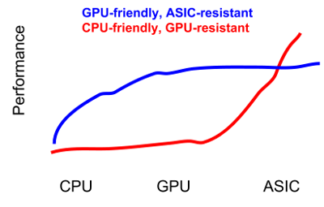

# Analysis of Ethash, Ethereum's Proof-of-Work puzzle

#### Table of Contents
* [Executive Summary](#ExecutiveSummary)
* [High Level Rationale](#High Level Rationale)
* [Overview of Ethash](#Overview)
* [Relation to Earlier Proof-of-Work Puzzles and Password Hashing](#PriorWork)
* [Comments on Design Process](#Design)
* [Planned Release and Update Schedule](#Updates)
* [Feasibility analysis of customized hardware configurations](#HardwareFeasibility)
* [Analysis of Randomizing Functions](#Randomizing)
* [Simplified Ethash models](#Models)


#### <a name="ExecutiveSummary"></a> Executive Summary
We study Ethereum's proposed proof-of-work puzzle. We find that its high level design goals (summarized as “GPU-friendly, ASIC-resistant”) are reasonable towards achieving its intended economic effect. The design is intended to encourage mining from diverse participants, while preventing the concentration of mining influence. The overall design of the puzzle (random paths over a fixed read-only dataset) is sound; it is closely related to prior work in academic literature on memory-bound proof-of-work puzzles and at at least one Password Hashing Competition finalist. We illustrate this connection by showing simplified strawman models.

The concrete instantiation of randomizing functions is nonstandard and difficult to cryptanalyze, but holds up to simple statistical tests. Overall, we believe that any hardware tradeoff applied to Ethash is likely to also apply to the simplified models and the related prior work.

The concrete parameterization is also reasonable; based on our analysis of electronic components available on the market, the most cost-effective hardware configuration would use the GDDR5 ram found in readily available graphics cards today. Therefore we believe that the most cost-effective customized mining hardware would make use of the same memory, limiting the potential performance increase.

Other aspects about Ethereum's design provide further discouragement of specialized hardware. For example, they have established a social contract that includes expecting compatibility-breaking hard-forks in the future, including altering the proof-of-work function itself.

Finally, we are somewhat concerned about the mechanism by which the memory capacity parameters are scheduled to increase over time. Essentially, the most popular graphics cards (with 2GB of memory) will be rendered suddenly unusable for mining at a time about 16 months after launch. We believe this horizon is adequately far in the future so as not to discourage participation in Ethereum mining during its infancy, and regardless the most *effective* (high-end) graphics cards will continue to be usable for several years. We believe this mechanism is ineffective at achieving its indended effect, but not terribly harmful.

## High Level Rationale

Before discussing the proposed proof-of-work function in detail, we set out some of the basic high-level rationales underlying design goals such as ASIC-resistance and memory-hardness.
Our goal will not be to thoroughly validate these rationales, instead just to give a coherent explanation of the motivation along with the leading counterarguments. This should serve to provide a clear background for the puzzle design. Ultimately, we believe the controversial arguments for or against ASIC-resistance remains inconclusive, and thus the high-level design goals of Ethash are a reasonable direction to take in the face of this uncertainty.

### The ``Fair Mining'' property is the fundamental underlying design goal.
The fundamental role of proof-of-work puzzles, in all cryptocurrencies, is to establish an incentive structure that leads towards decentralized but effective participation from a diverse population of miners. If decentralization were not the goal, then systems with concentrated power, where influence over the system is held by a small number of individual entities, could be made far simpler and cheaper, such as by using standard voting techniques. The connection between proof-of-work mining and this democratic principle was expressed as "One-CPU-One-Vote" in the original Bitcoin whitepaper.

Of course, not every *person* has exactly *one CPU*, and not all CPUs are equally powerful. So a more tractable form of this property might be "one-$-(spent-on-mining)-one-vote", which we call "fair mining". Even this ideal may seem too cynically cutthroat, as it would imply a sort of rich-get-richer arrangement that already trends towards power concentration; a response is that such wealth concentration exists in the ordinary world already, and the proof-of-work function doesn't seek to change this, only not to make it worse. Addititionally, this seems the best we can do: we don't know of a reliable decentralized way to globally assign one identity to each individual person that isn't subject to some form of sybil attack. In any decentralized system, we presume that an attacker can perfectly simulate `n` ordinary individuals for at most `n` times the resource cost that those individuals expend to participate.  If some candidate attack costs more than this, the attacker may alternatively pay individuals more than their cost to achieve a similar effect.

The "fair mining" ideal is not quite attainable. In general, due to economies of scale, and bulk discounts, there are values of `n` for which `n` times greater resource investment yields `m > n` better efficiency. For example, a data center full of minig equipment is typically proportionally cheaper because of bulk discounts on power and in purchasing hardware.

Closely approximating the fair mining ideal means two things: 1) maintaining a low barrier to entry, and 2) A relatively flat efficiency curve. This means that the mining hardware configurations available to individuals with a low amount of capital should be approximately as cost-effective as those available to wealthier entities, and the effect of super-linear performance due to economies of scale should be minimized. In particular, this is intended to prevent the economics of mining from reaching a winner-takes-all scenario, where the cost of mining is set by a very small number of maximally efficient miners, and everyone else has little or no incentive to participate at all.

An example of a proof-of-work puzzle that immediately fails to satisfy this design goal is a "progressive" puzzle, i.e., one that takes exactly a fixed number of sequential computational steps to solve (such as the repeated-squaring based puzzles from Dwork and Naor 1999). Consider a population where one individual can perform `t+1` steps in a time interval, while every other individual can perform only `t` steps. Then the faster individual can *always* find a puzzle solution before any of the other individuals (as long as the fixed number of steps is more than `t`). Proof-of-work puzzles in cryptocurrency are designed to be "progress-free" in order to avoid this degeneracy, typically by following a common structure where the puzzle can only be solved by making brute force attempts, each attempt of which has some independent chance of yielding a puzzle solution. Since attempts are independent and random, concurrent / uncoordinated individuals have a chance of finding a solution equal to the aggregate rate at which they can make attempts.

### ASIC-resistance

ASIC-resistance means several things. Ideally, it should discourage specialized hardware investment at all by making the *potential* improvements minimal. Hardware design engineers performing a back-of-envelope feasibility study for a potential ASIC development campaign should quickly come to the conclusion that the costs and risks are too high and the potential performance improvement is very low.
Even if there is a super-linear speedup, if the improvement is not huge (i.e., some small constant factor of improvement, but not 1000x) then it may be that no one ever overcomes this initial hurdle.

#### Arguments *against* ASIC-resistance

There is a counter argument to be made against the premise of ASIC-resistance at all - even if it is attainable, is it necessary or the best way to achieve the "fair mining" goal? Suppose we had a puzzle where specialized equipment was necessary to solve it, and general purpose equipment was next-to-useless, but the performance *ceiling* was low, meaning 1) the most efficient design configurations are roughly known to everyone with access to fabrication services, and 2) fairly small/cheap ASICs are roughly as performant as even the largest efficient hardare designs. If these properties are met, then we might quickly reach a point where the most efficient mining hardware is made available in small packages to anyone who wants it. Arguably, Bitcoin SHA-2 miners have nearly reached this point already. The most efficient ASICs essentially involve arranging many copies of a basic SHA-2 evaluation subcircuit on a single die. According to the [mining hardware wiki](https://en.bitcoin.it/wiki/Mining_Hardware_Comparison), the power efficiency and per-dollar throughput of one of the smallest mining rigs (the ASIC $38 AntMiner U3, 1.0 Ghash/joule, 1.648 GHash/s/$) is within a factor of 2 as the largest mining rig listed (Spondoolies $2235 SP35, 1.5 GHash/s/$ and 2.460 GHash/s/$).

Second, one of the arguments for the long-term rationality of *honest* Bitcoin mining is essentially based on the fact that investments in Bitcoin mining equipment cannot be recovered in any other way. If a dishonest miner participates in some attack that lowers the value of Bitcoin, then the miner must not only forego future mining profits, but would also be unable to sell the mining equipment. However, if the dishonest miner were using general purpose equipment such as GPUs, the resale value of these devices would not be as sharply affected by a decrease in Bitcoin value.

### GPU-friendly, ASIC-resistant

The Ethash design is intended to be maximally efficient on high-end GPUs, with a minimal potential performance gain for customized hardware. An alternative design approach would be to make even ordinary CPUs as effective as GPUs. The rationale for preferring the former rather than latter is summarised by the following quote from the wiki: "Targeting CPUs is almost certainly impossible." This is illustrated by the following stylized graph of the performance of CPUs, GPUs, and ASICs:


The argument is that general purpose CPUs are optimized in performance characterics for which we are unable to tune a proof-of-work puzzle, such as the ability to run in slower modes or power down portions of the chip, to perform out-of-order execution optimizations, etc.

#### What about Botnets?

A second reason to prefer GPU-friendly puzzles is to reduce the effectiveness of mining using botnets. Botnets have been using GPUs to mine for both Bitcoin and Litecoin since at least 2011 (see Botcoin: Monetizing Stolen Cycles). Botnets control millions of PCs, but make most of their income from activities like click-fraud and sending spam. Bitcoin mining is [no longer profitable on botnet machines](http://www.coindesk.com/mcafee-report-futile-mining-botnets-going-mainstream/), although this is at least partially due to the rising competition of Bitcoin ASICs. Mining can be supplemental income along with these other activities, although it comes at a cost, since fully utilizing the processor or GPU causes loud fans to spin, and thus can alert the user.

One reason to avoid botnet-friendliness is simply the societal harm (and thus negative image) of making crime more profitable. Since botnets are control by illicit actors, they may be more willing to engage in attacks, including double-spends. On the other hand, the same incentives that steer other actors towards honest mining also apply to botnets (e.g., if they take an action that lowers the trade value of Ether, they threaten their own future mining revenue). Thus it may not matter for the *security* of the network whether botnets mining or not.

It would be nice to make a table of CPU categories (old/medium/new) and GPU categories by population, estimate relative hashrate of each, use that to model how botnets might be feasible or not. e.g. if most botnets consist of older (less-secured) computers, where their outbound bandwidth or unique IP addresses are the resource of value, then few of these are likely to mine very fast, so the yield may be too low to be profitable (after the botnet rental costs are subtracted). If newer computers tend to be better secured (more likely to have antivirus/etc), and only newer computers are useful for mining, then botnets are less profitable.

If GPUs are the only way to go, new styles of botnets might appear, specifically targetting people with GPUs, for example malicious WoW mods that include trojans. However, botnets are valuable for both their node population count as well as their flexibility (eg: spam emission one day, DDOS the next). Both of these properties would be lacking in a high-end GPU-specialized botnet.

### Light Clients and SPV

Lightweight clients receive and verify the just the *Proof-of-Work chains* from their peers on the network, but do not need to receive or process any of the transactions in the blocks. A light client is able to be convinced that a transaction it cares about *has* been included in the *longest proof-of-work* chain that it knows about. However, it is not able to determine whether a proof-of-work chain it knows about is "valid", since whether a chain is valid depends on the transactions included in it. If we assume that a majority of miners only mine on the longest valid chain, then is is justified to *assume* that the longest proof-of-work chain is also a valid one. hence light clients can make secure inferences about contents of the correct blockchain by relying on the fully-validating behavior of miners. This mechanism was called Simplified Payment Verification (SPV) in the original Bitcoin whitepaper.

Since SPV clients validate the entire proof-of-work chain, it is important that checking proof-of-work puzzle solutions is very efficient. The Ethash design is intended to accomodate lightweight clients that require no more than 32 megabytes of working memory, and take no more than tens of milliseconds to validate even when implemented in Javascript. 

If the Compact SPV Proof technique underlying sidechains is successful, then light clients need not process every proof-of-work in a blockchain, and hence a PoW design could adjust its tradeoffs towards more expensive verification.

## <a name="Overview"></a> Overview of Ethash

Let's describe Ethash incrementally, through simplified strawman models, starting from the simplest to the most realistic.

#### First model
At the first level, (see the [Fixed-Dataset](FixedDatasetModel) model in the Appendix), suppose there is a fixed dataset (1GB) that is generated one-and-for-all, using true randomness. The puzzle proceeds like this: starting from a puzzle instance `puz` and a `nonce`, take the `hash` of these (where `hash` is treated as a random oracle) to initialize a random `mix` string: `mix := hash(puz || nonce)`. This mix string is used to select a random index into the dataset: `ind := mix % len(Dataset)`. The data accessed at that index is folded into a random accumulator by hashing again: `mix := hash(mix || Dataset[ind])`. This process repeats for `k` iterations, each time using the newest `mix` value to pick a new index, and fetching the data at that index to update the `mix` value. After the `k` iterations, the final mix value is compared to a threshold target, and if it has a sufficiently small value, then that `nonce` is a winning puzzle solution. Essentially, checking each attempt at a puzzle solution involves tracing a random path through the dataset.

To verify that a puzzle solution is correct, the verifier simply walks that path in the same order as the prover. This assumes that the verifier needs to store the 1GB dataset as well, which would obviously be frustrating for lightweight and mobile clients. It would be possible to fix this by building a Merkle tree over the dataset; if the client has the Merkle root, then he can check the PoW as long as it comes with the `k * log len(Dataset)` supporting Merkle hashes. Unfortunately this would still substantially add to the cost of transmitting around such proofs-of-work.

But let's ignore the cost of verification for now. This strawman puzzle design is essentially the same as [[DGN2003]](#DGN2003), which was the first memory-bound proof-of-work function proposed in the academic literature. This is a _memory-bound_ function because a) at least the size of the dataset must be allocated in order to attempt to find solutions, and b) the random access __throughput__ (i.e., accesses per second) of the memory determines the speed at which solutions can be checked. Note that the size of the dataset is intended to be large enough that it cannot fit in a typical processor's L1 cache (which is very fast), and also the size of each access is large enough (i.e., a full page size) that the throughput of a larger RAM can be fully utilized.

#### Second model
To address the shortcoming of the first approach, namely that the verifier needs to store the entire dataset (or alternately receive Merkle tree branches along with the solution), we want a compact representation of the large dataset.

In Ethash, and in the second simplified model thereof (see the [Fixed-Cache Model](FixedCacheModel) in the Appendix), this is achieved by having a much smaller fixed 32MB set of data, called the Cache. In the simplified model, the Cache is also generated once-and-for-all, at setup time, by sampling random bytes. The larger Dataset is generated pseudorandomly from the Cache. Each element of the Dataset is formed by hashing together a sequence of pseudorandom elments from the Cache (the number of elements is a parameter, called `DAG_PARENTS`):
```
def compute_dataset_element(i):
    x = hash(i)
    for j in range(DAG_PARENTS):
	    ind = x % len(Cache)
	    x = hash(x, Cache[ind])
    return x
```

In this strawman model, there is a clear alternative mining strategy, where the miner does not store the entire Dataset, but instead stores just the smaller Cache and generates Dataset elements on the fly. However, even discounting the cost of performing extra calls to `hash()`, this strategy requires a factor of `DAG_PARENTS` more memory throughput to compute. It is conceivable that it is more efficient to utilize higher throughput over a much smaller memory capacity; we analyze this potential tradeoff later on.

#### Remaining details in the real version

Our simplified models are useful for analyzing the core memory tradeoffs, but gloss over several details of the real puzzle, which we enumerate now:

 * The cache (and dataset) are generated pseudorandomly from a different seed each epoch (1000 blocks, i.e., 3.3 hours). This serves two main purposes: first, any unlikely degeneracy in a particular generated Dataset that leads to some miner advantage, only lasts for a short time; second, although mining in general uses _reads_ rather than _reads and writes_, it is still necessary to rewrite the Dataset storage periodically, so it is not feasible to build a circuit with the fixed Dataset baked in.
 * Scheduled growth of cache and dataset over time (dataset: ranging from 128MB to 8GB per year)
 * Instead of random oracles (or general-purpose hash functions, which are commonly used in place of random oracles), several customized efficient randomizing functions are used:
    * for selecting Cache elements used when generating the Dataset,
	* for mixing the Cache elements selected together to create each Dataset value,
	* and for selecting Dataset indexes when generating evaluating a potential puzzle solution.
 * The size of the dataset (and cache) are chosen to be prime numbers. This intended to avoid a possible bias in a random the SPIE random number generator (although this function is no longer used)

## <a name="PriorWork"></a> Relation to Earlier Proof-of-Work Puzzles and Password Hashing

#### Comparison with Prior Memory-bound puzzles
The motivation for the original PoW puzzles [[DGN2003]](#DGN2003) [[DNW2005]](#DNW2005) at the time was "fighting spam" by having users compute proofs-of-work to send along with email messages. This application never truly caught on (see [[LC2004]](#LC2004) because attackers (e.g., with botnets) typically have much more computing resources than honest users, and if the difficulty is set high enough to dissuade attackers then it is inconvenient for ordinary PCs. Cryptocurrencies avoid this problem, since the difficulty can be tuned much higher; average users with ordinary computers are not expected to mine, instead the typical miner is an enthusiast who obtains dedicated equipment (either a gaming-class GPU or a specialized mining-specific board or ASIC).

The approach is also closely related to one proposed in the academic literature. [[DNW2005]](#DNW2005). The main idea of [#DNW2005] is that the large dataset can be constructed from a very small seed; however, the verifier does need to construct the entire dataset this way. A 'pebbling' proof is provided that shows that an attacker cannot substantially reduce the _capacity_ of memory required to solve the puzzle, essentially because the dataset must be computed sequentially.

Compared to [[DNW2005]](#DNW2005), the Fixed-Cache Model of Ethash is different for two main reasons:
1. The elements of the Dataset can be generated independently or concurrently, rather than all at once,
2. However, the Cache from which the Dataset is generated is much larger than a single small seed.

The first difference suggests that an alternate mining strategy is to compute the Dataset elements on the fly, greatly reducing the _capacity_ of memory required. 


The password hashing research community has been very active recently, and use essentially the same techniques. Hence it is important to learn from them as much as possible.

#### Comparison with Password Hashing

Password hashing has been an active area of research recently, with a large Password Hashing Competition used to encourage the development and cryptanalysis of better password hashing functions. The motivation of password hashing is based on password authentication systems, where a server stores a file of password hashes on disk, and every time a client wants to authenticate themselves to the server, the server computes the hash of the submitted password and compares it to the hashes stored on disk. The point of the password hash function is to make it more expensive for an attacker who steals the server's password *file* from recovering the user's passwords. If an ordinary hash like SHA2 is used, then attackers can used optimized hardware (like Bitcoin mining rigs!) to try hashing potential passwords at an extremely fast rate and extremely efficiently compared to an ordinary server. Thus the goal of "ASIC resistance" in password hashing is roughly the same as the goal of "ASIC resistance" in proof-of-work puzzles for cryptocurrency. Furthermore, the basic approach taken by modern password hashing functions is the same as the approach taken in proof-of-work puzzles, namely to make the bottleneck be _memory_ performance rather than CPU performance.

This connection between password hashing and proof-of-work has useful implications: economic analysis, constructions, and cryptanalysis provided by the password hashing community may be applied to the design of proof-of-work.

However, there are several differences between the recent trends in password hashing versus proof-of-work puzzles:

 * Most modern password hashing candidates are _sequential memory hard_ rather than _memory throughput hard_. Ethash (along with the simplified strawman models we've presented and the prior work on memory-bound proof-of-work puzzles [[DGN2003]](#DGN2003) [[DNW2005]](#DNW2005)) involve filling up memory with a fixed dataset, and many potential puzzle solutions can be evaluated concurrently by reading from this common dataset. If the memory has high latency, but good parallel throughput, the entire throughput of the memory can be utilized by having several pipelined solution-checking tasks. However, in password hashing candidates such as scrypt, Catena, and Lyra2, the contents of the memory is _different_ for each solution attempted. SolarDesigner, author of the _yescrypt_ password hashing candidate, calls this distinction "Parallel ROM-hard" rather than Sequential Memory-hard. He gave a presentation advocating this tradeoff to the password hashing community http://www.openwall.com/presentations/ZeroNights2012-New-In-Password-Hashing/ZeroNights2012-New-In-Password-Hashing.pdf
 * There is no equivalent of _verification_ as opposed to forward computation in password hashing. Thus the design aspects of proof-of-work puzzles that make verification very cheap would not be useful for password hashing.
 * It is uncertain in the password hashing community whether "GPU-friendly-ASIC-hard" is preferable to "GPU-resistant". On one hand, the password hash is typically executed on a server, which is an ordinary computing device. On the other hand, servers are dedicated and more expensive than end-user machines, for example, and so it is reasonable that these machines could be assembled with a GPU or even a dedicated password hashing hardware device. The Password Hashing Competition's use-case is usually server/service-oriented: it's ok if you must purchase special hardware to be a defender (e.g. take advantage of everything that your rented server has to offer, if it helps to defend). Servers usually have more RAM than you need for an auth-table lookup: use it for big ROM tables. GPUs aren't too hard to get (annoying, but can be rented from EC2), so if that forces the attacker to follow suit, it's a win.

_Recommendation: communicate with the password hashing community as a source of cryptanalysis and review. Our analysis and explanation in terms of prior work provides a starting point for how the Ethereum community can talk to the PHC community and get them involved: what they have in common, what are the differences._

## <a name="Design"></a> Comments on Design Process

#### Multiple reference implementations

The various Ethereum reference implementations have been developed concurrently (along with the yellowpaper specification), in several different languages:
* Javascript
* Python
* C++
* OpenCL (for GPU mining)

The output of each of the reference implementations are compared against each other on test vectors.
Overall this is a sound way of catching bugs, since bugs in the different implementations are unlikely to be in the same place. Even better, the implementations are written by different people.

#### Tuning for GPU implementation

The OpenCL implementation was written while the Ethash algorithm was simultaneously evolving. The parameters of Ethash have been iteratively tuned during this process in order to ensure that the GPU implementation is efficient, and in particular utilizes its entire available memory throughput.

[https://github.com/ethereum/ethash/blob/master/src/libethash-cl](https://github.com/ethereum/ethash/blob/master/src/libethash-cl)

The GPU used during development was a Radeon HD 7850:
* Effective Bandwidth: 124533 MB/s
* Maximum possible bandwidth: 153.6 GB/s
* Bandwidth utilization: 81%
* Price: $170 [(newegg)](http://www.newegg.com/Product/Product.aspx?Item=N82E16814129230)

#### Recent history of tweaks suggests future history of tweaks
The last month has seen a flurry of changes to the Ethash wiki page, with parameter tweaks and significant algorithm changes. This will probably continue until the genesis deadline. It suggests that we do not yet have enough information to choose ideal parameters.

For this reason, we've focused our analysis primarily on the high level design, which has essentially been stable for several months.

_Recommendation: continue to evaluate other parameterizations that may yield more efficient GPU implementations_

## <a name="Updates"></a> Planned Release and Update Schedule

#### 9-month overhaul

The Ethereum developers have stated [(on the development blog)](https://blog.ethereum.org/2015/03/03/ethereum-launch-process/) that they plan to overhaul the protocol with potentially backward-incompatible (i.e., hard-forking) changes after 9 months. Such an overhaul could potentially include a new or modified proof-of-work puzzle. The time in between should should provide an opportunity to learn from GPU optimization efforts, small-client/SPV development, and from other efforts such as the PHC community. They should keep reminding folks that this overhaul is coming, using the moral authority / "supervote" (the extra power they get by being project leads) to convince miners to accept this change.

It is important for the project to provide competitively-optimized mining code, to everybody (as opposed to Bitcoin's first GPU miner, which was closed-source and sold/rented to other users). If one miner finds a clever way to achieve a large speedup, and that speedup is broken by the 9-month overhaul, they will resist the change, and may manage to block it.

If there *is* a way to make ASICs advantaged, the threat/expectation of upcoming overhaul may deter development until after the overhaul occurs. If a significant investment into non-flexible ASICs (or other mining technology) occurs early, it will become harder to make changes to the PoW function.

Encouraging mining with general purpose devices rather than ASICs should make it easier (technically and politically) to update the PoW puzzle in the future, since investment in algorithm-specific ASICs need not be defended. In fact, establishing a social expectation that such changes are possible should further discourage investment in algorithm-specific hardware designs.

#### Gradual increase in memory usage parameters

The current PoW function ("revision 20") calls for the large dataset (which must be held in RAM to mine efficiently) to start at 1GB in size, and increase over time, at a linear rate of 735 megabytes per year.

If the dataset size were extremely small, at some point it would become cost effective to encode the dataset as a multiplexing circuit directly into a reprogrammable FPGA. The danger of this parameter being too high is that widely available GPU memory capacity may not grow fast enough to accomodate this increase in dataset size.

We looked at Newegg for GPUs that have at least 1GB of memory capacity, sorted descending by price, and cross referenced the results with the litecoin mining wiki. All the 1GB cards are relatively weak, and and either don't show up in litecoin mining wiki or are at the bottom rung of effectivenes. The *most popular* (by # products of newegg) memory size is 2GB. The good news is that at a rate of 735MB per year, *most* GPUs that anyone would want to use will still be usable for at least 1 year (and the 1GB that are kicked out almost immediately wouldn't be widely used anyway). On the other hand, if the rate increase was 8GB per year, then most GPUs will be unusable for Ethereum mining in a matter of months.

Regardless of the parameters, this approach has the following undesirable effects:
 * A GPU will very *suddenly* become unusable once its available memory capacity is insufficient to hold the cache. This is in contrast to the gradual obsolescence that occurs when the difficulty factor increases in response to new hardware being added to the network
 * ASICs and custom application boards might be designed to support extra memory capacity expansions when needed
 * The analysis of throughput/price of lower capacity memory configurations shows the memory-throughput-hardness of the puzzle is not very sensitive to the capacity size. If the memory capacity later turns out to be smaller relative to the cutting edge of graphics cards, this should not have a detrimental effect.

In order to calculate the effectiveness of a GPU with inadequate space to store the entire dataset, we can use a calculation explained in the [Permacoin paper](http://cs.umd.edu/~amiller/permacoin_full.pdf). Suppose the graphics card can store a fraction $P < 1$ of the dataset. Consider the following hybrid strategy, parameterized by `1 <= S <= ACCESSES`:

```python
attempt(puz, nonce):
    mix = hash(puz, nonce)
    ind = mix % len(dataset)
    for i = 1 to S:
       if ind is in the set stored on the GPU:
           mix = hash(mix, dataset[ind])
       otherwise: 
           return None # try again!

    for i = S+1 to ACCESSES:
       ind := next_index()
       if ind is in the set stored on the GPU:
           mix = hash(mix, dataset[ind])
       else:
           mix = hash(mix, compute_dag_element(cache, ind))
           # Almost done, so stick it out! Compute the hard way!
```

If the hybrid strategy encounters an index outside its stored portion of the Dataset before the `S`th iteration, then it abandons that attempt; after the `S`th iteration, the hybrid strategy computes the next value the hard way, using the Cache. Assuming the cost of computing an element from Cache is some fixed factor slower than fetching it from the Dataset (e.g., because fetches from Cache and from Dataset together must utilize the GPUs bandwidth), then for some value of `S`, this hybrid strategy is the *optimal* approach to mining. 

In the following figure we illustrate how the `S` value of the optimal strategy changes along with the portion of the Dataset stored, assuming that computing a Dataset element takes 1024x as long as fetching it from memory. When more than 94% of the dataset is stored, 'misses' are infrequent enough that it is more cost effective to abort and try again when one is encountered, even if it occurs on the very last iteration. However, as misses become more common, it is better to incur the higher cost of computing a dataset element on the fly.


Regardless of the optimal hybrid strategy, the cost of missees quickly adds up. The following figure illustrates the effective mining efficiency of the optimal hybrid strategy given varying portions of the Dataset stored. As one example: given the rate of Datset size increase of ~735MB per year, when 2GB cards begin to lose efficiency (16 months from now), they will drop from 100% to 50% efficient over a timespan of roughly three weeks.


_Recommendation: do not automatically increase the dataset size, or increase it at a very slow rate. Wait for the 9-month overhaul, then observe trends in GPU memory size and other hardware to decide about increasing the dataset size._

#### Infancy Attacks

It may be difficult to encourage mining participation to reach a sufficiently large point early on. In particular, attacks from large botnets are more of a threat early on when participation is at its lowest.

_Recommendation: should ensure that mining participation reaches a high level quickly. This could include making published GPU mining software available as soon as possible to miners, and tuning towards widely available GPUs already held by miners._

#### Replacement with Proof-of-Stake

Ethereum has stated their intentions to switch away from Proof-of-Work entirely, towards proof-of-stake. We believe this creates both uncertainty and varying future predictions. It Is uncertain whether this research effort will pay off or not, and opinions on whether proof-of-stake is viable so far appear to be divided (many people believe Proof-of-Stake is feasible and inevitable, others believe it is inherently flawed). Individual participants who believe Proof-of-Stake *is* within reach in 9 months may be discouraged from investing in mining rigs today.

## <a name="HardwareFeasibility"></a> Feasibility analysis of customized hardware configurations


### Hardware tradeoff analysis

What is the optimal hardware configuration for mining? Ideally, the GPUs that the reference implementation was developed on should be nearly optimal. Modern GPUs use a high-performance memory design called GDDR5. Since the puzzle is READ-only parallel hard, it is conceivable that an alternate hardware configuration optimized for reads would be more cost effective. We searched for representative examples of datasheets from manufacturers and prices from online catalogs for various kinds of memory. DDR still seems like the most cost-effective technology right now.

#### NAND Memory

NAND Flash memory is the non-volatile memory commonly used in solid state disks and USB stick drives. Unlike dynamic RAM, it does not require power to keep its state. It is highly optimized for reads, whereas writes are much more expensive. Here is a thesis describing how it works and measuring some performance: http://www.ece.umd.edu/~blj/papers/thesis-PhD-cagdas--SSD.pdf

Here is a datasheet for a commercially-available NAND-flash that stores 8 gigabit of data, which matches the ethash dataset size (1Gigabyte). The page size is 4kilobytes, which also matches ethash. It takes 30 microseconds to load a memory into the register, and 4096 cycles * (25 nanoseconds / cycle) to read out a page of data. This means 132.4us to read a page, for a total bandwith of ~30.2MBps.
http://www.toshiba.com/taec/components2/Datasheet_Sync/201403/DST_TC58NVG3S0FBAID-TDE_EN_31579.pdf

This can be purchased for $7.3 each in quantities in the thousands.
http://avnetexpress.avnet.com/store/em/EMController/Flash/Toshiba/TC58NVG3S0FBAID/_/R-5003960814049/A-5003960814049/An-0?action=part&catalogId=500201&langId=-1&storeId=500201

One of the Ethash OpenCL implementors reported achieving rates of 50GB/s on his graphics card doing Ethash. This GPU is as fast as $12,000 worth of this NAND-flash.

A GPU memory can consume on the order of 100 watts. (https://users.soe.ucsc.edu/~jzhao/files/islped209-zhao.pdf) The EEPROM uses 30 mA while reading, at 3.3 volts input, which is about 0.1 watts. The datasheet says maximum power dissipation of 0.3 watts. Compared to 100 watts, this is a relative improvement of only 333x. Thus $2500 of these NAND-Flash chips would consume as much power as a GPU and still produce less memory throughput.

#### NOR Flash Memory

NOR flash is a sort of inverse arrangement compared to NAND flash. It generally has a smaller page size, and is better suited to low-latency access or access to smaller reads. It Is even slower to write than NAND flash. It's well suited for "execute-in-place" embedded applications, (like the instruments on a car) where this is used as the program memory, since then the program doesn't have to be loaded from from separate storage into RAM.

It Is possible to find parts for either 1MB or (near) 1GB. Even at the smaller option, the price is not much less than GDDR5 and its read throughput is a thousand times worse.

1. Spansion (Megabyte) [[Datasheet]](http://www.spansion.com/Support/Datasheets/S29AL008J_00.pdf) [[Catalog]](http://avnetexpress.avnet.com/store/em/EMController/Flash/Spansion/S29AL008J70TFI013/_/R-8660939/A-8660939/An-0?action=part)

 * Capacity: 1 Megabyte
 * Price: $0.58
 * Throughput: 10MBps (Data width: 16 bit, Clock: 5.0Mhz)

2. Spansion (Gigabit) [[Datasheet]](http://www.spansion.com/Support/Datasheets/S29GL-P_00.pdf) [[Catalog]](http://avnetexpress.avnet.com/store/em/EMController/Flash/Spansion/S29GL01GP11TFIR13/_/R-5001560802753/A-5001560802753/An-0?action=part)
 * Capacity: 256 Megabyte
 * Price: $8.71
 * Throughput: (Data width: 16 bit, Clock: 10.0Mhz)

#### SRAM (Like in an L2 Cache)

SRAM is the very fast and low-latency memory used in L2 caches (on-chip in modern CPUs). SRAM is far too expensive to store the entire 1GB dataset. On the other hand, it could feasibly store a 1MB cache. If a lower-capacity hardware configuration (just enough for the 1MB cache) had sufficiently higher throughput than the full-capacity configuration (storing the entire 1GB dataset), then it could become more cost effective to mine using the light option.

For this analysis we are looking at hardware efficiency alone (and not power efficiency). We are only looking at products whose capacity (density) is at least 1MB. We assume that the dataset computation operation involves reads that are at least the full word size, therefore look at only the maximum throughput. (In general, this memory is intended for low-latency caches, and is tuned so that page sizes should be very small and page boundaries should matter very little).

The high price of SRAM means it is less cost effective than DDR, even though it has good throughput.

1. Cypress SRAM QDR IV [[Datasheet]](http://www.cypress.com/?docID=48337)
  * Price: $176 (very high!)
  * Throughput: 9.6GBps (Data width: 72 bits, Clock: 1066MHz)
  * Capacity: 9 Megabytes


2. GSI SRAM [[Catalog]]](http://avnetexpress.avnet.com/store/em/EMController/SRAM-Chip/Gsi-Technology/GS881E32CD-333/_/R-8657369/A-8657369/An-0?action=part)
  * Price: $19.8
  * Capacity: 1 Megabyte 
  * Throughput: 1.33 GBps (Data width: 32 bits, Clock: 333MHz)

3. Cypress NoBL SRAM: [[Catalog]](http://www.digikey.com/product-search/en?mpart=CY7C1354C-200AXC&vendor=428)
  * Price: $13.38
  * Capacity: >1 Megabyte
  * Throughput: 0.9 GBps (Data width: 36 bits, Clock: 200Mhz)


#### Low capacity DRAM

We looked at the most cost effective SDRAM chips containing at least 1MB of capacity. These would be unsuitable for storing the entire Dataset, but could reasonably store the Cache. In terms of throughput per dollar, they are *slightly* better than the GDDR ram we found. Of course, they would need to provide a throughput/cost at least 512 times better to make computing Dataset elements on the fly more effective.

* Alliance SDRAM [[Catalog]](http://avnetexpress.avnet.com/store/em/EMController/Alliance-Memory-Inc/AS4C1M16S-7TCNTR/_/R-5003754444256/A-5003754444256/An-0?action=part) [[Datasheet]](http://www.alliancememory.com/pdf/dram/16M-AS4C1M16S.pdf)
  * Capacity: 2 Megabyte
  * Throughput: 0.288 GBps (Data width: 16 bits, Clock: 144MHz)
  * Price: $0.86
  * Power dissipation: 1 Watt (max rating)

#### Graphics Ram GDDR5

[Micron's intro to GDDR5](http://www.micron.com/~/media/documents/products/technical-note/dram/tned01_gddr5_sgram_introduction.pdf)

A single GDDR5 chip has several memory cores (banks) which are accessed in parallel, using a shared address wire for all the banks. A GPU typically has several GDDR5 chips that themselves can be accessed in parallel.

* Micron GDDR5 high capacity chip
 [[Catalog]](http://avnetexpress.avnet.com/store/em/EMController/_/A-5004434793197/An-0?action=part)
  * $4.4
  * Capacity: 256 Megabytes
  * Throughput: 0.875GBps (7.0 Gbps)
  * Power dissipation: 1 Watt (max rating)

The GDDR5 memory chips available from catalogs outperform the SRAM on throughput-per-dollar. They come within a factor of two of the cheap SDRAM, which has vastly smaller capacity. Thus as long as the total size of "cache" fetches needed to compute a "dataset" element exceeds twice the size of a dataset element, it is not any more cost effective to use smaller RAM.

### Drum architecture, TMTO-ish

Imagine a custom memory architecture that didn't provide fast random access, but did provide fast sequential access. Then hang a lot of small circuits off of it. The large ROM is like a big drum, and the circuits are taps. The drum rotates quickly, the circuits wait for the table entry they need to come around.

The circuit size depends upon how much state is maintained in the main hashing loop: the width of the mix. The throughput of each circuit is the rotation speed of the drum (dataset size times clock rate) times ACCESSES. If the circuits are small enough, the parallelism of having millions of circuits might make up for the relatively long time to complete any given trial.

While we think a design like this is plausibly more cost effective at large scale, we are uncertain how to proceed any further with a feasibility analysis of this complicated design.

## <a name="Randomizing"></a> Analysis of Randomizing Functions

It Is common in cryptographic applications to use a general-purpose hash function (e.g., SHA-3) as an "instantiation" of a random oracle, even though no concrete hash function can truly provide all the properties of a random oracles.
In order to a) reduce the cost of light-client verification, and b) ensure that widely available GPU's can fully utilize their memory throughput rather than bottlenecking on some computation, Ethash does not use a general purpose hash function, but instead use less-expensive randomizing functions. These include:
    * a mixing function inspired by the FNV hash (which itself is not cryptographically secure, e.g., it may be possible to find collisions)
	* Sergio Demian Lerner's RandMemoHash,
    * SPIE (this is no longer used)

_Recommendation: We recommend developing and evaluating a variant of the PoW function (just as a possible fall-back option) that uses widely-studied general-purpose hash functions (such as SHA-2, SHA-3, or Blake2) instead of the customized faster alternatives._

### Cycle length

One important requirement of the randomizing function is that it should not have a short cycle, i.e. a value `x` for which `step(step(....step(x))) == x`, for some small number of steps. This is more clearly relevant for an earlier form of the puzzle (for example, [Revision 12](https://github.com/ethereum/wiki/wiki/Ethash/7a62129e7381a1b6215c34009a6e240654d55e46)), the main loop of which looks roughly like this:
```python
rand = hash(puz, nonce)
mix = hash(puz, nonce)
for _ in range(ACCESSES):
    ind = rand % (len(Dataset) / MIX_WIDTH)
	mix = hash(mix, Dataset[MIX_WIDTH*ind+j])
	rand = step_prng(rand)
```
Here, the index at each step is a function of `rand`, and `rand` follows a pseudorandom sequence starting with `hash(puz, nonce)` and the update at each step is independent of the contents of the dataset. Hence if it were possible to find values with short cycles (shorter than `ACCESSES`), then a miner could simply generate lots of candidate values of `nonce` until `hash(puz, nonce)` was known to have a short cycle, and then it would be possible to finish checking the puzzle solution with fewer accesses to the Dataset.

In newer revisions, the location of each access depends on the value of the data accessed in the previous iteration, so the cycle length is less relevant.

### Free of algebraic relations

There should be no exploitable algebraic relationship between the numbers. For example, consider a broken strawmen PRNG:
```python
  def step_prng(x): return (x + 1) % (1<<32)
```
Given this defective prng, each subsequent access is simply the next item in memory. This would mean that all the data needed to check a candidate puzzle solution could be loaded using a single sequential read of a large size. This has an optimal cycle length, yet it still leads to a bad outcome if the intent is to have a memory-bound puzzle.

### FNVish hash

FNV is a noncryptographic hash; it is is not considered cryptographic secure hash for three reasons listed here:
https://tools.ietf.org/html/draft-eastlake-fnv-08#section-6.1

1. It is very quick to compute. This is undesirable for, e.g., password hashing, where brute force *preimage* or *birthday* attacks should be prevented, but it is not relevant here because the cost is intended to be dominated by memory accesses anyway
2. The FNV is sensitive to reaching a state where the internal state value is zero; if this happens, and if an adversarially chosen input has a range of zero bytes, then the state stays zero until a non-zero input is reached. Since only pseudorandom inputs (the Cache and Dataset data) are provided as input to this function, this concern is not relevant. Also simply finding collisions does not lead to a shortcut in finding puzzle solutions.
3. The least significant bit of the resulting FNV hash has a simple algebraic relationship with the least significant bit of the input. This could conceivably allow an adversary to predict whether the next access is even or odd, reducing the memory capacity need by a factor of 2 in some cases.

Ethash uses a function "inspired" by FNV, which we call `FNVish`, but which differs in the following ways:
1. FNVish performs a single iteration of `v1 * PRIME ^ v2`, whereas FNV mixes in the input data one byte (octet) at a time
2. In the FNV hash, the multiplication by `PRIME` is taken mod 32 bits, whereas in FNVish, the result of the multiplication could be up to 64 bits in size, and the projection to 32 bits occurs after the XOR.

_Recommendation: we recommend not calling the function `fnv` simply because it is inspired by `fnv` and superficially similar._

Regardless, for purpose in Ethash, this mixing function appears to us to be adequately applied.
_Evaluation: We believe it is likely that any memory-tradeoff attack on Ethash would also apply to the simplified Ethash models, rather than taking advantage of the peculiarities of how data fetches are mixed in using FNVish._

### Safe Prime Iterated Exponentiation (SPIE)

```python
   P = 2*q + 1 # an approximately 32-bit safe prime
   def step_spie(x):
      return powmod(base=x, expon=3, modulus=P)
```

This is inspired by the [Blum-Blum-Shub (BBS)](http://en.wikipedia.org/wiki/Blum_Blum_Shub) cryptographically-secure random number generator.

```python
   P = p * q # a *large* product of primes
   """The two primes, p and q, should both be congruent to 3 (mod 4)
   (this guarantees that each quadratic residue has one square root which
   is also a quadratic residue) and gcd(phi(p - 1), phi(q - 1)) should be
   small (this makes the cycle length large)."""
   def step_bbs(x):
      return powmod(base=x, expon=2, modulus=P)
```

BBS is notable because its suitability as a PRNG can be proven by reduction to factoring large composite numbers (an RSA modulus).
The differences are:

* The size of BBS should be large enough that factoring is hard - namely, more than 32 bits, whereas the proposed size of SPIE is small enough (32-bits) that factoring is practically easy
* The factorization of the composite modulus in BBS should be unknown (i.e., discarded after a trusted setup).
* Every element in BBS is a member of a quadratic residue subgroup; it can be obtained by raising a generator of this subgroup to some power. However, since arbitrary integers in the range [2,P-2] are used as possible SPIE seeds, some of these values do not necessarily lie in a cyclic subgroup.

_We recommend using the name SPIE rather than "modified-BBS", as BBS suggests a connotation (a CSPRNG with reductions to studied problems) that neither hold for this construction nor are necessary for this application._

#### Diehard Tests

We implemented the SPIE function in the `dieharder` randomness testing framework.
[https://github.com/amiller/dieharder/blob/eth/libdieharder/rng_eth.c](https://github.com/amiller/dieharder/blob/eth/libdieharder/rng_eth.c)

The dieharder does not properly handle random number generators whose output range is not `[0,2^n-1]` from some number `n`. Hence to evaluate this in dieharder, we projected the output of SPIE to a smaller range, `[0,2^31]`, by rejection sampling. Afterwards it passes all of the remaining tests, most of the time. The output of a test is here: https://gist.github.com/amiller/d5820200fd9444af937c


## <a name="Models"></a> Simplified Ethash models

`hash()`: a hash function (either `64`-byte digests, or `(MIX_WIDTH * 64)`-byte digests, depending on context), modeled as a random oracle

`TARGET`: a difficulty threshold

### <a name="FixedDatasetModel">1.</a> The Fixed-Dataset model

```python
Dataset # a fixed, random 1GB array, 64-byte elements
ACCESSES = 1024
MIX_WIDTH = 2 # number of 64-byte elements read

def setup():
    for i in range(0,len(Dataset)):
        Dataset[i] = random() # 64 bytes

def check_proof_of_work(puz, nonce):
    mix = hash(puz,nonce) # MIX_WIDTH * 64 bytes
    for _ in range(ACCESSES):
	    ind = mix % (len(Dataset) / MIX_WIDTH)
		for j in range(MIX_WIDTH):
            mix = hash(mix, Dataset[MIX_WIDTH*ind+j])
	if hash(mix) < TARGET: return True
	else: return False

def mine(puz, ntries):
    for _ in range(ntries):
	    nonce = random()
		if check_proof_of_work(puz, nonce): return nonce
    return None # failed after ntries
```

### <a name="FixedCacheModel">2.</a> The Fixed-Cache model

```python
Cache   # a fixed, random 1MB array, 64-byte elements
Dataset # a 1GB array, pseudorandomly computed from Cache

ACCESSES = 1024
DAG_PARENTS = 1024 # number of Cache accesses per Dataset element
MIX_WIDTH = 2 # number of 64-byte elements read


def compute_dataset_element(i):
    x = hash(i)
    for j in range(DAG_PARENTS):
	    ind = x % len(Cache)
	    x = hash(ind, Cache[ind])
    return x

def setup():
    for i in range(0,len(Dataset)):
        Dataset[i] = compute_dataset_element(i)

def check_proof_of_work(puz, nonce):
    mix = hash(puz,nonce) # MIX_WIDTH * 64 bytes
    for _ in range(ACCESSES):
	    ind = mix % (len(Dataset) / MIX_WIDTH)
		# compute dataset on-the-fly
		mix = hash(mix, compute_dataset_element(MIX_WIDTH*ind+j)) 
	if hash(mix) < TARGET: return True
	else: return False

def mine(puz, ntries):
    for _ in range(ntries):
	    nonce = random()
		mix = hash(puz,nonce) # MIX_WIDTH * 64 bytes
		for _ in range(ACCESSES):
	        ind = mix % (len(Dataset) / MIX_WIDTH)
			# use precomputed dataset
			mix = hash(mix, Dataset[MIX_WIDTH*ind+j]) 
			if hash(mix) < TARGET: return nonce
    return None # failed after ntries

```

## References Cited

* <a name="DNW2005">[DGW2005]</a> Dwork, C., Naor, M., Wee, H. Pebbling and Proofs of Work. CRYPTO-2005.

* <a name="DGN2003">[DGN2003]</a> Dwork, C., Goldberg, A., and Naor, M. 2003. On memory-bound functions for fighting spam. In Advances in Cryptology-CRYPTO 2003. Lecture Notes in Computer Science, vol. 2729. Springer, 426-444.

* <a name="LC2004">[LC2004]</a> Laurie, B., and Clayton, R. 2004. “Proof-of-Work” Proves Not to Work. In Workshop on Economics and Information, Security. 2004.

#### document source

This file generated from https://github.com/LeastAuthority/ethereum-analyses .
